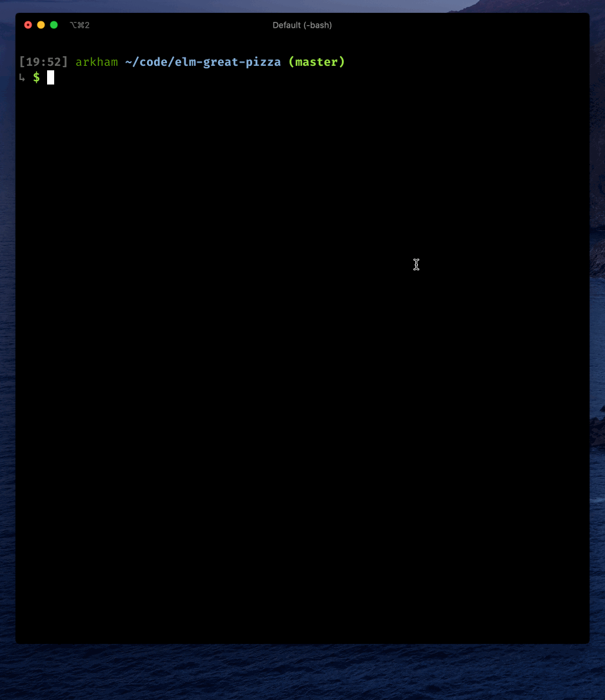
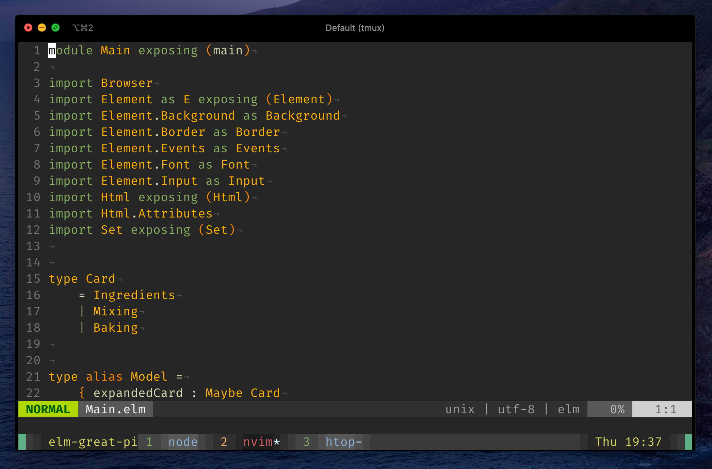

I friggin' love [tmux](https://github.com/tmux/tmux). It makes my
day-to-day terminal experience **so**. **much**. **better**. Being
efficient in tmux means you don't need tabs any longer. It means you can
update your terminal emulator while keeping your work intact. It means you
can sling panes and windows across your terminal as if you were the Last
Airbender. It's that good.

I thought I'd share a couple of tricks I've picked up over the years. I'd
heartily recommend reading and understanding each line of your configuration:
in this way, when things go wrong (and they will), you'll be more likely to
have a hunch of the cause of the problem.

Here's a short demo:



## Mac OS install

```bash
$ brew install tmux
```

## tat

First of all I want you to add this function to your `~/.bashrc` or `~/.zshrc`
or whichever shell you're using:

```bash
# tat: tmux attach
function tat {
  name=$(basename `pwd` | sed -e 's/\.//g')

  if tmux ls 2>&1 | grep "$name"; then
    tmux attach -t "$name"
  elif [ -f .envrc ]; then
    direnv exec / tmux new-session -s "$name"
  else
    tmux new-session -s "$name"
  fi
}
```

This function:

- gets the name of the current directory and removes periods, which tmux
  doesn't like.
- if any session with the same name is open, it re-attaches to it.
- otherwise, it checks if an `.envrc` file is present and starts a new tmux
  session using `direnv exec`.
- otherwise, starts a new tmux session with that name.

This is what I do every time I start working on any project:
open the terminal, `cd` into the folder, then `tat`.

Now let's take a look at the tmux configuration.

## General configuration

Your config should live in `~/.tmux.conf`.

### Mouse

```bash
set -g mouse on
```

Welcome to the twenty-first century.

### Command history

```bash
set -g history-limit 102400
```

> Those who cannot remember the past are condemned to repeat it.

### Window management

```bash
set -g base-index 1
setw -g pane-base-index 1
```

By default, tmux will number panes and windows starting from `0`. I find
indexing things from `1` to be more ergonomic, especially when you want to
quickly switch between windows.

```bash
set -g renumber-windows on
```

By default, after you delete a window tmux will remember the previous
index of the other windows. Why? I dunno, but this gets rid of it.

### Keys modes

```bash
# Use emacs keybindings in the status line
set-option -g status-keys emacs

# Use vim keybindings in copy mode
setw -g mode-keys vi

# Fix ESC delay in vim
set -g escape-time 10
```

Even if you're a hardcore vim user, you'll want to use emacs keybinding in
the status line.

## Key Bindings

### Prefix

```bash
unbind C-b
set -g prefix C-a
```

The prefix is the entry point to each command you're going to use. I chose
`Ctrl-a` because it's easier to press with my left hand.

```bash
bind C-a send-prefix
```

Since we set `Ctrl-a` to be our prefix, it will be intercepted by tmux and
won't be forwarded to any program. With this setting, we can press it twice
to send it through anyways.

### Copy mode

```bash
unbind-key -T copy-mode-vi v

bind-key -T copy-mode-vi v \
  send-keys -X begin-selection

bind-key -T copy-mode-vi 'C-v' \
  send-keys -X rectangle-toggle

bind-key -T copy-mode-vi y \
  send-keys -X copy-pipe-and-cancel "pbcopy"

bind-key -T copy-mode-vi MouseDragEnd1Pane \
  send-keys -X copy-pipe-and-cancel "pbcopy"
```

In tmux, you can enter navigation mode by pressing `Ctrl-a [`. Once
you're in that mode, you can navigate the buffer as if you were inside a
VIM buffer. Now you can:

- search for things with `/`; find next matches with `n` and previous
  matches with `N`.
- start a visual selection with `v`; you can switch to rectangle mode with
  `Ctrl-v`.
- copy the visual selection into your OS clipboard with `y`; this will
  automatically cancel the selection. The same works by just highlighting
  text with your mouse.

### Quick reload

```bash
bind r source-file ~/.tmux.conf \; display "Config reloaded!"
```

A blessing when you're testing out changes in your config.

### More windows management

```plain
bind c new-window -c '#{pane_current_path}'
```

Press `Ctrl-a c` to open a new window with the same path.

```plain
bind '\' split-window -h -c '#{pane_current_path}'
bind - split-window -v -c '#{pane_current_path}'
```

Use `Ctrl-a \` to open a vertical split (it's the same key with the
`|` symbol). Use `Ctrl-a -` to open a horizontal split.


```bash
bind b break-pane -d
```

Press `Ctrl-a b` to break the current pane into a new window.

Another shortcut I use all the time is `Ctrl-a z` to expand the current
pane full-screen. Press it again to return to your previous pane
configuration.

### Vim integration

First of all, install
[vim-tmux-navigator](https://github.com/christoomey/vim-tmux-navigator) and
add these lines to your `~/.vimrc`:

```vim
nnoremap <C-J> <C-W>j
nnoremap <C-K> <C-W>k
nnoremap <C-H> <C-W>h
nnoremap <C-L> <C-W>l
```

These will allow us to switch between Vim splits by just pressing
`Ctrl-j` instead of `Ctrl-w j`. Then add this to your
`~/.tmux.conf`:

```plain
is_vim="ps -o state= -o comm= -t '#{pane_tty}' \
    | grep -iqE '^[^TXZ ]+ +(\\S+\\/)?g?(view|n?vim?x?)(diff)?$'"
bind-key -n 'C-h' if-shell "$is_vim" 'send-keys C-h'  'select-pane -L'
bind-key -n 'C-j' if-shell "$is_vim" 'send-keys C-j'  'select-pane -D'
bind-key -n 'C-k' if-shell "$is_vim" 'send-keys C-k'  'select-pane -U'
bind-key -n 'C-l' if-shell "$is_vim" 'send-keys C-l'  'select-pane -R'
tmux_version='$(tmux -V | sed -En "s/^tmux ([0-9]+(.[0-9]+)?).*/\1/p")'
if-shell -b '[ "$(echo "$tmux_version < 3.0" | bc)" = 1 ]' \
    "bind-key -n 'C-\\' if-shell \"$is_vim\" 'send-keys C-\\'  'select-pane -l'"
if-shell -b '[ "$(echo "$tmux_version >= 3.0" | bc)" = 1 ]' \
    "bind-key -n 'C-\\' if-shell \"$is_vim\" 'send-keys C-\\\\'  'select-pane -l'"

bind-key -T copy-mode-vi 'C-h' select-pane -L
bind-key -T copy-mode-vi 'C-j' select-pane -D
bind-key -T copy-mode-vi 'C-k' select-pane -U
bind-key -T copy-mode-vi 'C-l' select-pane -R
bind-key -T copy-mode-vi 'C-\' select-pane -l
```

Now you will be able to seamlessly navigate between Vim splits and tmux
panes using `Ctrl-h`, `Ctrl-j`, `Ctrl-k`, and `Ctrl-l`. You can switch
between the last two panes by repeatedly pressing `Ctrl-\`.

## Cool status bar

```
set-option -g status-justify left
set-option -g status-left '#[bg=colour72] #[bg=colour237] #[bg=colour236] #[bg=colour235]#[fg=colour185] #S #[bg=colour236] '
set-option -g status-left-length 16
set-option -g status-bg colour237
set-option -g status-right '#[bg=colour236] #[bg=colour235]#[fg=colour185] %a %R #[bg=colour236]#[fg=colour3] #[bg=colour237] #[bg=colour72] #[]'
set-option -g status-interval 60

set-option -g pane-active-border-style fg=colour246
set-option -g pane-border-style fg=colour238

set-window-option -g window-status-format '#[bg=colour238]#[fg=colour107] #I #[bg=colour239]#[fg=colour110] #[bg=colour240]#W#[bg=colour239]#[fg=colour195]#F#[bg=colour238] '
set-window-option -g window-status-current-format '#[bg=colour236]#[fg=colour215] #I #[bg=colour235]#[fg=colour167] #[bg=colour234]#W#[bg=colour235]#[fg=colour195]#F#[bg=colour236] '
```
Here's a preview:



## Fin

If you'd like, you can get a copy of the whole config [here](https://github.com/Arkham/dotfiles.nix/blob/master/tmux.conf). If you don't feel like maintaining this configuration yourself you can try out [tmux-sensible](https://github.com/tmux-plugins/tmux-sensible).

Feel free to reach out on Twitter for help. That's all, thanks for reading! 🌊
