I've recently bumped into [Elm
Warrior](https://github.com/Skinney/elm-warrior), an Elm adaptation of
[Warrior JS](https://warriorjs.com/). The premise of the game is to write a
simple AI that is able to navigate through multiple levels of a dungeon.
This is how the first level looks like:

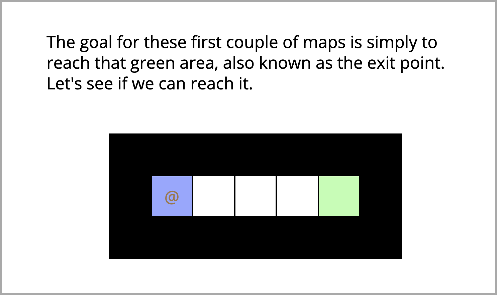

You (the warrior) are represented by the `@`. You always start on the blue
tile and your goal is to reach the green tile. I thought it would be a cool
idea to write down how to approach solving a problem like this.

Before we start, a word of warning...

## SPOILERS AHEAD!
## SPOILERS AHEAD!!
## SPOILERS AHEAD!!!

Now that my conscience is clear, I'll start by copying the exposed values
and functions from each top-level module and pasting them all together. No
docs, no type signatures, nothing, just their **names**. As [the sage once
said](https://cs.fit.edu/~ryan/rose.html):

> Stat rosa pristina nomine, nomina nuda tenemus.

Which roughly translates as:

> The rose of old remains only in its name. Only naked names we possess.

Let's get moving, shall we?

```elm
module Warrior exposing
    ( Warrior, Action(..)
    , id, position
    , health, maxHealth, healingPotential
    , attackDamage, inventory
    )

module Warrior.Coordinate exposing
    ( Coordinate
    , toString
    )

module Warrior.Direction exposing
    ( Direction(..)
    , all, toString
    )

module Warrior.History exposing
    ( History
    , roundsPlayed, previousStates, previousActions
    )

module Warrior.Item exposing
    ( Item(..)
    , toString
    )

module Warrior.Map exposing
    ( Map
    , look, lookDown
    )

module Warrior.Program exposing
    ( TurnFunction
    , Model, Msg
    , Config, program
    )
```

At this point we clearly don't understand what is going on with the code,
but just by reading this listing a couple of times we are getting familiar
with the _names_ of this particular domain. Just let it soak in.

Now I'm getting more curious and will take a look at these exposed data
constructors: `Direction`, `Action`, and `Item`. Whenever a module exposes
the inner contents of a type, that's an invitation to the world to depend
on those values, so I'm sure it's going to be useful to take a peek.

```elm
type Direction
    = Left
    | Right
    | Up
    | Down

type Action
    = Wait
    | Heal
    | Pickup
    | Move Direction
    | Attack Direction

type Item
    = Sword
    | Potion
```

There is a lot of information packed in these simple names, so don't worry
if you feel a bit overwhelmed. Instead, let's try something practical and
look at the first level.

## Level I

Let's start [here](https://ellie-app.com/989KZm4BrVMa1).

The source on the left hand side reads like this:

```elm
main : Program () Program.Model Program.Msg
main =
    Program.program
        { maps = Maps.all
        , players = [ ( "Player", takeTurn ) ]
        , msPerTurn = 500
        , progressionFunction = Progression.reachExitPoint
        }


takeTurn : Warrior -> Map -> History -> Warrior.Action
takeTurn warrior map history =
    Warrior.Wait
```

We can see on the right hand side that every 500 ms a `Player waits`
message is being printed. So instead of simply waiting, we have to make our
warrior move to the right. Let's import `Direction` and change the
`takeTurn` function:

```elm
takeTurn : Warrior -> Map -> History -> Warrior.Action
takeTurn warrior map history =
    Warrior.Move Right
```

Onwards and upwards!

## Level II

You'll see that [after completing level
I](https://ellie-app.com/9m5z9YyLvTFa1), your warrior will be
automatically teleported to the next level, which looks like this:

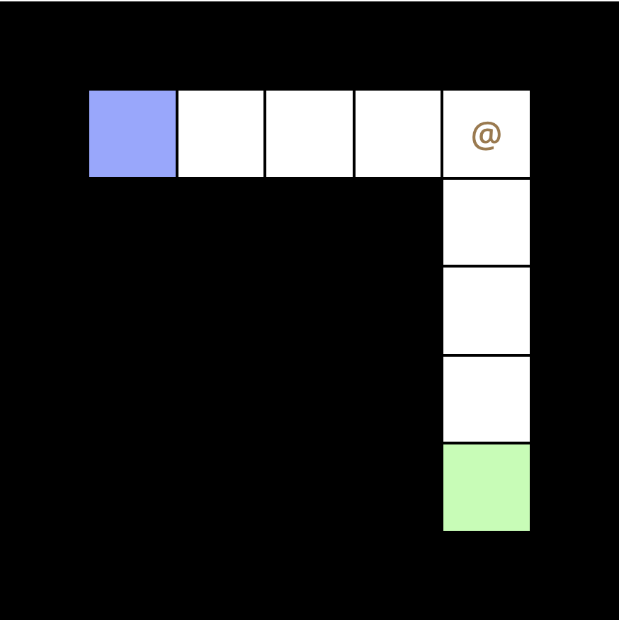

Our warrior can only move right each step, and since the dungeon turns
downwards, it gets stuck there. Poor fella.

Now it's the time to look more in depth at a function inside the `Map`
module:

```elm
{-| Provides a list of everything the warrior can see in a
specific direction. The first item of the list will be the
one tile away. The second item will be two tiles away, etc.
-}
look : Direction -> Warrior -> Map -> List (Coordinate, Tile)
```

What's that `Tile` value?

```elm
type Tile
    = Wall
    | Empty
    | SpawnPoint
    | Exit
    | Warrior String
    | Item Item
```

So the simplest way to pass this level is:

- check if we can move right; if so, proceed
- check if we can move down; if so, proceed.

```elm
takeTurn : Warrior -> Map -> History -> Warrior.Action
takeTurn warrior map history =
    case Map.look Right warrior map of
        ( _, Empty ) :: _ ->
            Warrior.Move Right

        ( _, Exit ) :: _ ->
            Warrior.Move Right

        _ ->
            case Map.look Down warrior map of
                ( _, Empty ) :: _ ->
                    Warrior.Move Down

                ( _, Exit ) :: _ ->
                    Warrior.Move Down

                _ ->
                    Warrior.Wait
```

I know, I know, there is some duplication. Let's resist the urge to
refactor straight away and enjoy our fleeting moment of success. 🍵

## Level III

[Here](https://ellie-app.com/9m5QgdLcLzva1) we are.

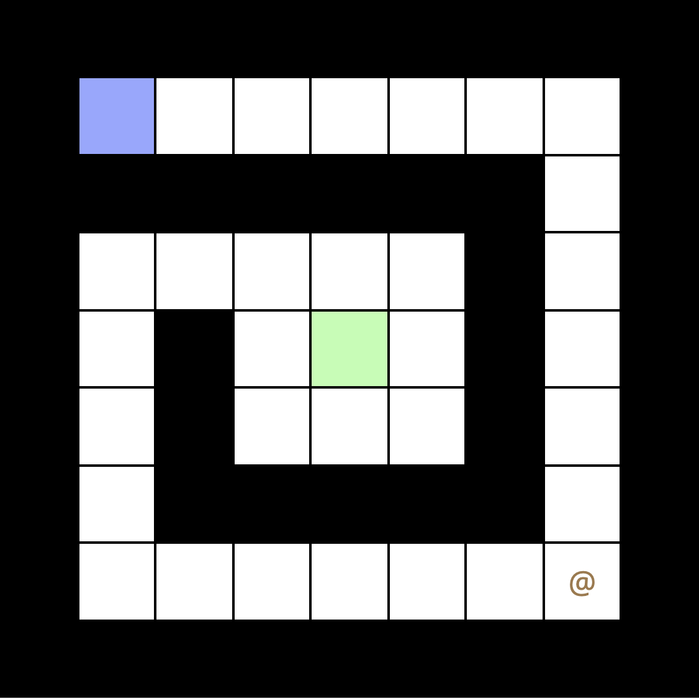

Things are getting more complicated, and it's clear that our nesting of
case expressions won't fit the bill any longer. We need our warrior to try
to walk into any possible direction. We can do this by:

- folding over a list of possible directions
- checking if we found a good direction to move
- if yes, we are done
- if no, try with the next direction.

To represent the idea that we might have found a good move we're going to
use a `Maybe Warrior.Action` as the value of the accumulator.

```elm
takeTurn : Warrior -> Map -> History -> Warrior.Action
takeTurn warrior map history =
    let
        checkDirection dir =
            case Map.look dir warrior map of
                ( _, Empty ) :: _ ->
                    Just (Warrior.Move dir)

                ( _, Exit ) :: _ ->
                    Just (Warrior.Move dir)

                _ ->
                    Nothing
    in
    [ Right, Down, Left, Up ]
        |> List.foldl
            (\dir acc ->
                case acc of
                    Just v ->
                        acc

                    Nothing ->
                        checkDirection dir
            )
            Nothing
        |> Maybe.withDefault Warrior.Wait
```

Unfortunately this is the result...

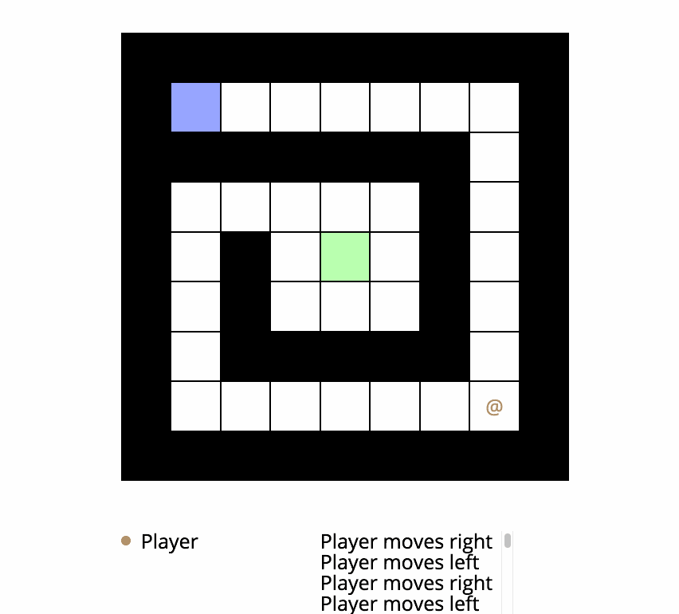

The problem with our approach is that we're using a stateless algorithm and
we're not checking if we already visited the same tile in the past. Now
let's take another look at the `History` module. We'll find this function:

```elm
{-| Returns a list of the state of a warrior and the map,
going back to the first turn. The first element in the list
will represent the state of the warrior and the map at the
beginning of that warrior's last turn.
-}
previousStates : Warrior -> History -> List ( Warrior, Map )
```

What we get is a list of all previous states of our warrior, along with the
state of the map at the time. So we can use the `position` function from
the `Warrior` module to detect if we ever visited that tile before.

```elm
takeTurn : Warrior -> Map -> History -> Warrior.Action
takeTurn warrior map history =
    let
        alreadyVisited coords =
            History.previousStates warrior history
                |> List.any
                    (\( w, _ ) ->
                        Warrior.position w == coords
                    )

        checkDirection dir =
            case Map.look dir warrior map of
                ( newCoords, Empty ) :: _ ->
                    if alreadyVisited newCoords then
                        Nothing

                    else
                        Just (Warrior.Move dir)

                ( _, Exit ) :: _ ->
                    Just (Warrior.Move dir)

                _ ->
                    Nothing
    in
    [ Right, Down, Left, Up ]
        |> List.foldl
            (\dir acc ->
                case acc of
                    Just v ->
                        acc

                    Nothing ->
                        checkDirection dir
            )
            Nothing
        |> Maybe.withDefault Warrior.Wait
```

Tada! 🎉

## Level IV

So [here](https://ellie-app.com/9mqpJDnTq8ca1) is where we are now.

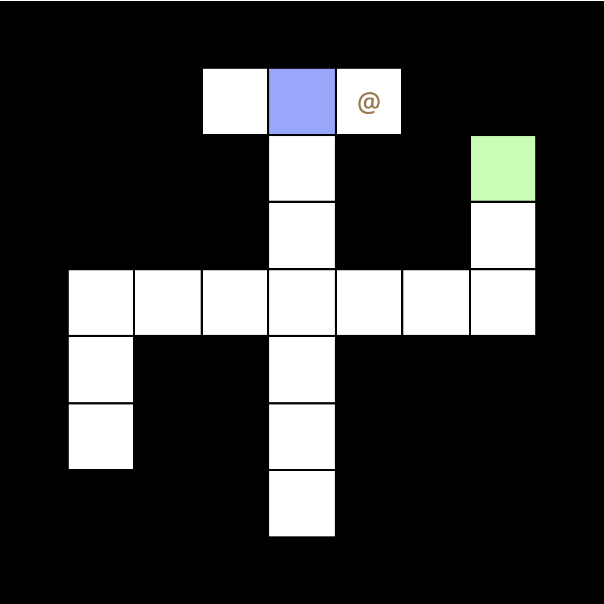

Our warrior is now stuck on the top right corner. Why is that? Well, we
just added some logic that makes the warrior skip tiles which have been
visited in the past. In this case, we went down a path which turned out to
be a dead end, so we **need to backtrack**.

So instead of completely avoiding to step on a tile that has already been
visited, we can think which are the possibilities when we want to explore
the world in a certain direction. We can find:

- the exit tile
- an empty unvisited tile
- an empty already visited tile
- a wall tile

So what we can do is to assign a value to each of these possibilities, so
that we can choose the best available move every time. The great thing
about Elm is how easy it is to create types for everything, so let's do
that.

```elm
type Exploration
    = Freedom
    | CanMove Int
    | NoGo
```

The `Int` that we attached to `CanMove` describes how many times we have
visited that tile in the past. So now all we have to do is to rewrite our
`takeTurn` function to consider each move and select the best. We can do
that using `List.sortWith`:

```elm
{-| Sort values with a custom comparison function.

    sortWith flippedComparison [1,2,3,4,5] == [5,4,3,2,1]

    flippedComparison a b =
        case compare a b of
          LT -> GT
          EQ -> EQ
          GT -> LT

This is also the most general sort function, allowing you
to define any other: `sort == sortWith compare`
-}
sortWith : (a -> a -> Order) -> List a -> List a
```

So we need to provide our own comparison function...

```elm
compareExploration : Exploration -> Exploration -> Order
compareExploration first second =
    if first == second then
        EQ

    else
        case ( first, second ) of
            ( Freedom, _ ) ->
                LT

            ( CanMove x, CanMove y ) ->
                compare x y

            ( CanMove _, NoGo ) ->
                LT

            ( CanMove _, _ ) ->
                GT

            ( NoGo, _ ) ->
                GT
```

You will notice that better options have a "lower value": in this way when
we're done sorting our list, the best option will be the head of the list
;)

Now all we have to do is to change `takeTurn` to explore each direction and
choose the best option:

```elm
takeTurn : Warrior -> Map -> History -> Warrior.Action
takeTurn warrior map history =
    let
        visitedCount coords =
            History.previousStates warrior history
                |> List.filter
                    (\( w, _ ) ->
                        Warrior.position w == coords
                    )
                |> List.length

        exploreDirection dir =
            case Map.look dir warrior map of
                ( newCoords, Empty ) :: _ ->
                    ( CanMove (visitedCount newCoords)
                    , Warrior.Move dir
                    )

                ( newCoords, SpawnPoint ) :: _ ->
                    ( CanMove (visitedCount newCoords)
                    , Warrior.Move dir
                    )

                ( _, Exit ) :: _ ->
                    ( Freedom
                    , Warrior.Move dir
                    )

                _ ->
                    ( NoGo
                    , Warrior.Wait
                    )
    in
    [ Right, Down, Left, Up ]
        |> List.map exploreDirection
        |> List.sortWith
            (\( a, _ ) ( b, _ ) -> compareExploration a b)
        |> List.head
        |> Maybe.map Tuple.second
        |> Maybe.withDefault Warrior.Wait
```

Now we can grab some popcorn and watch the progress...

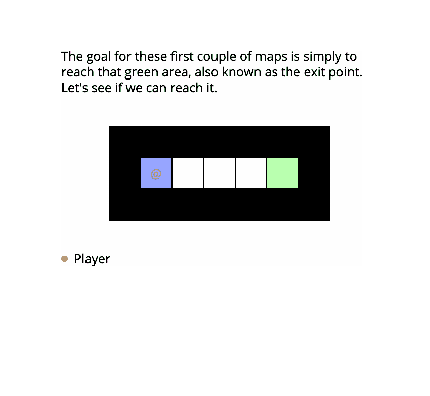

Our warrior managed to complete in a swift dash levels four, five, six and
seven!

## Level VIII

So [here](https://ellie-app.com/9w6xzNZz7BNa1) is where we are stuck now.

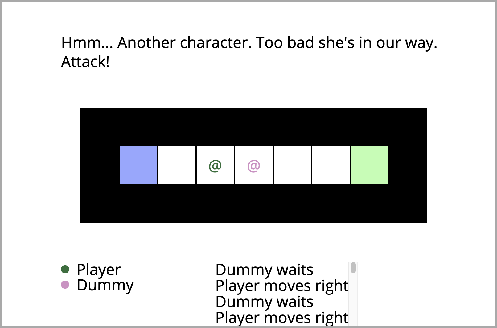

We have met an enemy, exciting! We can add another option to `Exploration`:

```elm
type Exploration
    = Freedom
    | Enemy
    | CanMove Int
    | NoGo
```

Then follow some type errors to fix a missing branch in the case statement
within our `compareExploration` function:

```elm
compareExploration : Exploration -> Exploration -> Order
compareExploration first second =
    if first == second then
        EQ

    else
        case ( first, second ) of
            ( Freedom, _ ) ->
                LT

            ( Enemy, _ ) ->
                LT

            ( CanMove x, CanMove y ) ->
                compare x y

            ( CanMove _, NoGo ) ->
                LT

            ( CanMove _, _ ) ->
                GT

            ( NoGo, _ ) ->
                GT
```

Then, when we meet another warrior in our path, we can attack them :)

```elm
exploreDirection dir =
    case Map.look dir warrior map of
        ( newCoords, Empty ) :: _ ->
            ( CanMove (visitedCount newCoords)
            , Warrior.Move dir
            )

        ( newCoords, SpawnPoint ) :: _ ->
            ( CanMove (visitedCount newCoords)
            , Warrior.Move dir
            )

        ( newCoords, Warrior _) :: _ ->
            ( Enemy
            , Warrior.Attack dir
            )

        ( _, Exit ) :: _ ->
            ( Freedom
            , Warrior.Move dir
            )

        _ ->
            ( NoGo
            , Warrior.Wait
            )
```

Success! 🎉

## Level IX

Let's check [this](https://ellie-app.com/9w6Ps3mJNtJa1) out.

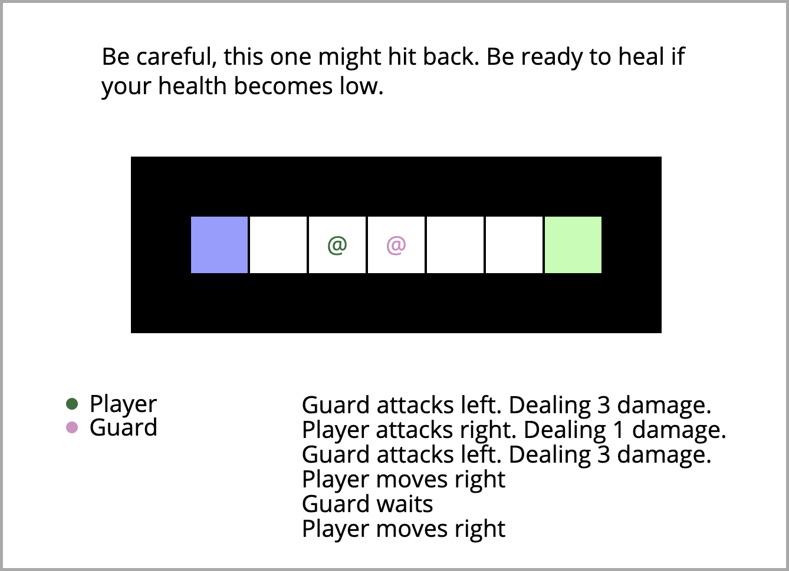

Now, this is a tricky one. We're facing a guard that's much stronger than
us. If we remain in the same spot and keep exchanging blows, we'll die!

As the level suggests, when we notice we're not feeling well, we can try to
heal:

```elm
{-| Get the health of a warrior.
-}
health : Warrior -> Int


{-| Get the maximum health the warrior can have.
    The warrior will start a map with this much health.
-}
maxHealth : Warrior -> Int
```

The issue is that if we try to heal while standing near the enemy, it will
keep attacking us, ultimately leading to our ghastly demise.

Let's do a bit of refactoring first: we're going to split up our `takeTurn`
function into a couple of smaller functions:

```elm
allDirections : List Direction
allDirections =
    [ Right, Down, Left, Up ]


exploreDirection :
    Warrior
    -> Map
    -> History
    -> Direction
    -> ( Exploration, Warrior.Action )
exploreDirection warrior map history dir =
    let
        visitedCount coords =
            History.previousStates warrior history
                |> List.filter
                    (\( w, _ ) ->
                        Warrior.position w == coords
                    )
                |> List.length
    in
    case Map.look dir warrior map of
        ( newCoords, Empty ) :: _ ->
            ( CanMove (visitedCount newCoords)
            , Warrior.Move dir
            )

        ( newCoords, SpawnPoint ) :: _ ->
            ( CanMove (visitedCount newCoords)
            , Warrior.Move dir
            )

        ( newCoords, Warrior _ ) :: _ ->
            ( Enemy
            , Warrior.Attack dir
            )

        ( _, Exit ) :: _ ->
            ( Freedom
            , Warrior.Move dir
            )

        _ ->
            ( NoGo
            , Warrior.Wait
            )


takeTurn : Warrior -> Map -> History -> Warrior.Action
takeTurn warrior map history =
    allDirections
        |> List.map (exploreDirection warrior map history)
        |> List.sortWith
            (\( a, _ ) ( b, _ ) -> compareExploration a b)
        |> List.head
        |> Maybe.map Tuple.second
        |> Maybe.withDefault Warrior.Wait
```

Now we can add a function to check if an enemy is nearby:

```elm
isEnemyNearby : Warrior -> Map -> Bool
isEnemyNearby warrior map =
    allDirections
        |> List.any
            (\dir ->
                case Map.look dir warrior map of
                    ( _, Warrior _ ) :: _ ->
                        True

                    _ ->
                        False
            )
```

And another one to tell if our warrior has been wounded:

```elm
isWounded : Warrior -> Bool
isWounded warrior =
    Warrior.health warrior < Warrior.maxHealth warrior
```

Now in our `exploreDirection` function, when we meet another warrior, we
can check our fighting spirit:

```elm
( newCoords, Warrior _ ) :: _ ->
    if isWounded warrior then
        ( NoGo
        , Warrior.Wait
        )

    else
        ( Enemy
        , Warrior.Attack dir
        )
```

And in `takeTurn`:

```elm
takeTurn : Warrior -> Map -> History -> Warrior.Action
takeTurn warrior map history =
    if not (isEnemyNearby warrior map) && isWounded warrior then
        Warrior.Heal

    else
        allDirections
            |> List.map (exploreDirection warrior map history)
            |> List.sortWith
                (\( a, _ ) ( b, _ ) -> compareExploration a b)
            |> List.head
            |> Maybe.map Tuple.second
            |> Maybe.withDefault Warrior.Wait
```

What happens now?

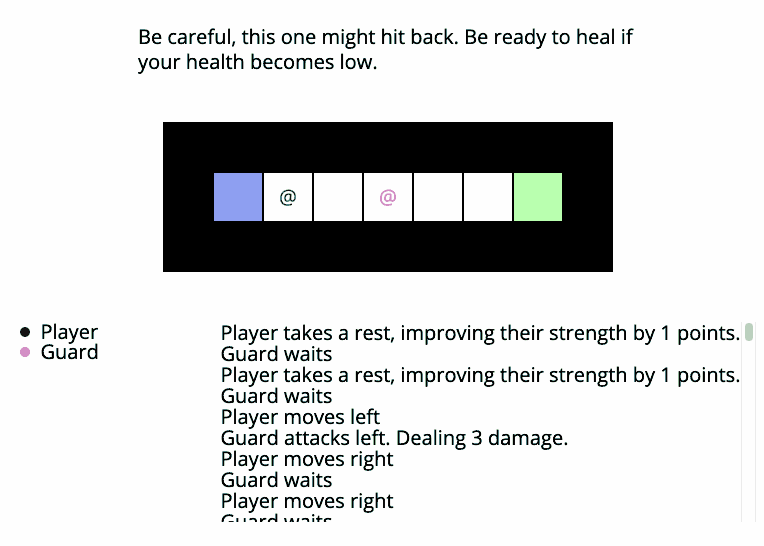

Turns out that as soon as we move near the other warrior, we get attacked.
Therefore, we immediately run away to heal, then try again. As much as I am
a pacifist, we still need to find a way to pass this level.

What's the solution this time? To endure a little bit of pain...

Instead of running away as soon as we get slightly wounded, we can keep
fighting for a bit and only run away when we're badly wounded.

```elm
isBadlyWounded : Warrior -> Bool
isBadlyWounded warrior =
    Warrior.health warrior < Warrior.maxHealth warrior // 4
```

Now, we're going to replace the use of `isWounded` inside our
`exploreDirection` function. We still want the original function inside
`takeTurn` because we want to heal back to full health when we're safe.

```elm
( newCoords, Warrior _ ) :: _ ->
    if isBadlyWounded warrior then
        ( NoGo
        , Warrior.Wait
        )

    else
        ( Enemy
        , Warrior.Attack dir
        )
```

Success!

## Level X

We're [here](https://ellie-app.com/9NGC6Q2YbZra1) now.

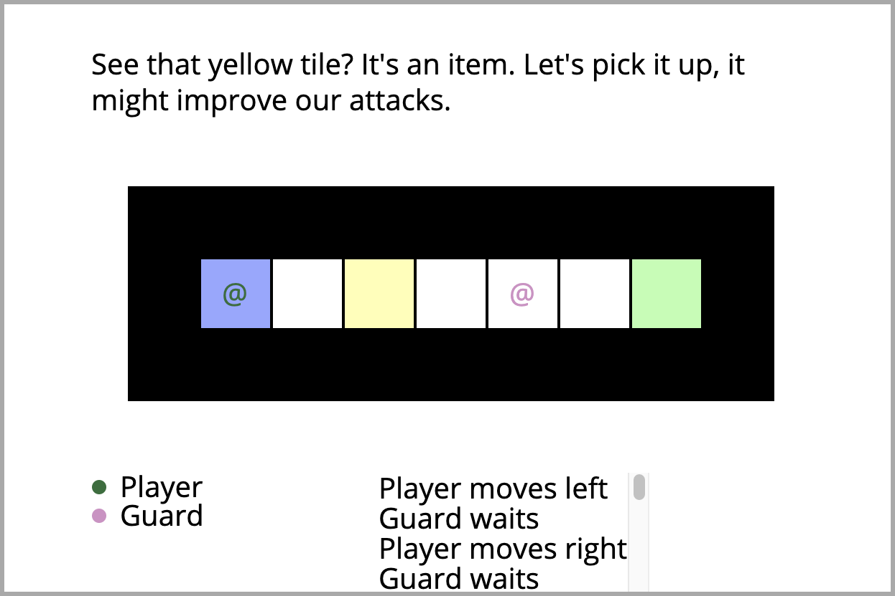

Ooh, items! Let's go and grab them 🏴‍☠️

We'll need to add a new branch in the case statement in `exploreDirection`:

```elm
( newCoords, Item _ ) :: _ ->
    ( CanMove (visitedCount newCoords)
    , Warrior.Move dir
    )
```

And change our `takeTurn` function to pickup the item if we are standing on
it:

```elm
case
    ( isEnemyNearby warrior map
    , isWounded warrior
    , Map.lookDown warrior map
    )
of
    ( False, True, _ ) ->
        Warrior.Heal

    ( _, _, Item _ ) ->
        Warrior.Pickup

    _ ->
        allDirections
            |> List.map (exploreDirection warrior map history)
            |> List.sortWith
                (\( a, _ ) ( b, _ ) -> compareExploration a b)
            |> List.head
            |> Maybe.map Tuple.second
            |> Maybe.withDefault Warrior.Wait
```

These changes will get us through [both levels ten and
eleven](https://ellie-app.com/9NGZqhRjqTGa1)!

## One more thing...

On the last level we can notice something a bit weird:

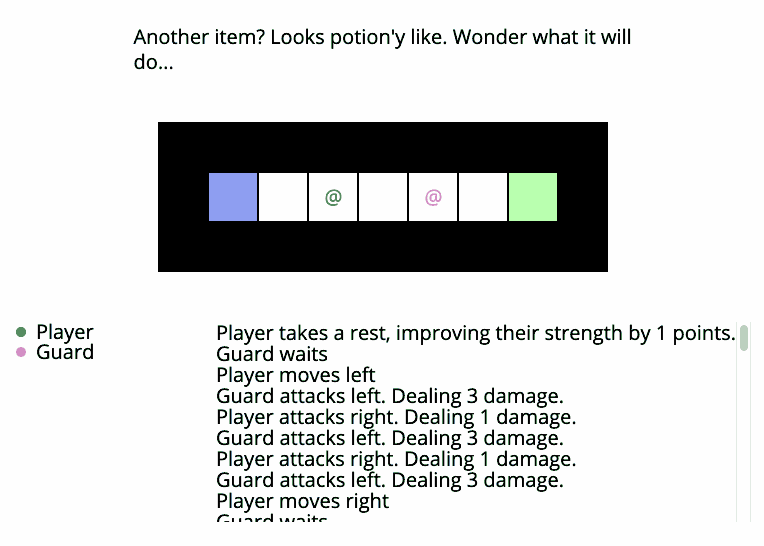

After we run away from the fight and we heal ourselves to full health we
start doing a weird left and right dance on the first two tiles. Why is
that?

It turns out we have a small bug in our `visitedCount` helper:

```elm
visitedCount coords =
    History.previousStates warrior history
        |> List.filter
            (\( w, _ ) ->
                Warrior.position w == coords
            )
        |> List.length
```

Since we spend many turns healing, we end up having a lot of states in our
history where the position of the warrior is the same, which ends up
inflating the number of times we have "visited" that tile. The fix is to
only consider the position of the warrior when it's moving:

```elm
visitedCount coords =
    History.previousStates warrior history
        |> List.foldr
            (\elem acc ->
                if List.head acc == Just elem then
                    acc

                else
                    elem :: acc
            )
            []
        |> List.filter
            (\( w, _ ) ->
                Warrior.position w == coords
            )
        |> List.length
```

With our final fix [in place](https://ellie-app.com/9NHbrJTp8QBa1), it's showtime!


Thanks for reading! 👋
