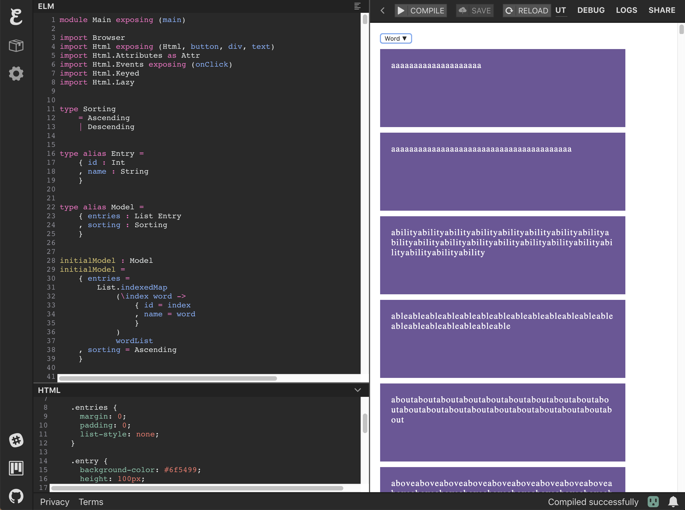
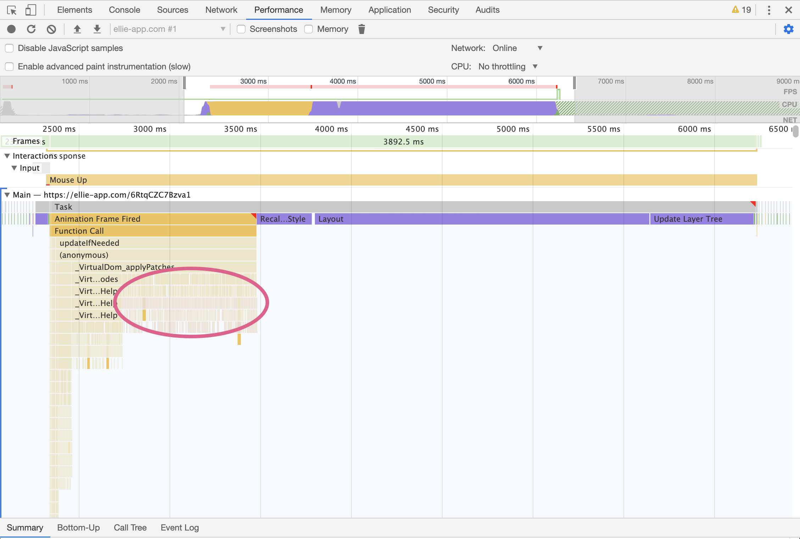
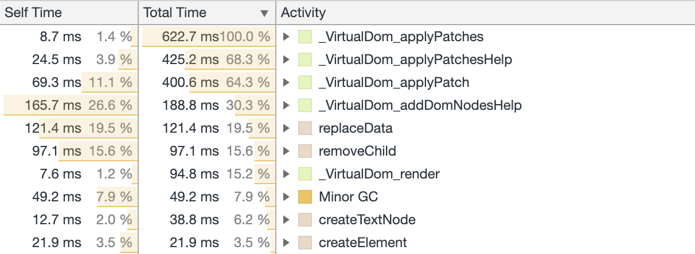
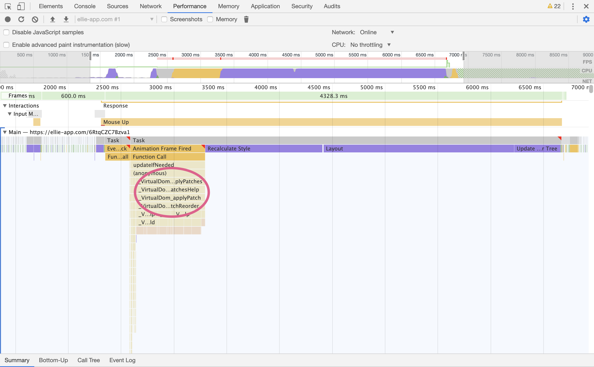
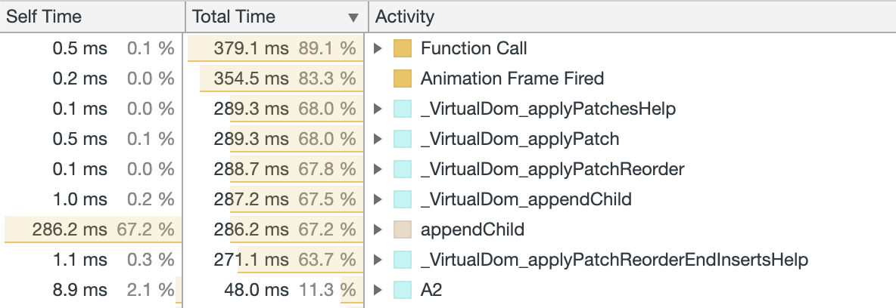
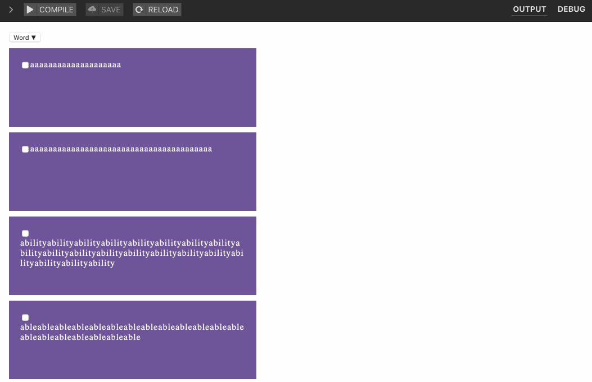

This is the second post in a series which explores optimization techniques
to build performant Elm applications. But first, let's take a bit of a
detour and talk about [Saint Thomas](https://en.wikipedia.org/wiki/Thomas_the_Apostle).

Saint Thomas was one of twelve apostles of Jesus and he is also known as
_Doubting Thomas_. Why is that? Because of one specific episode in the New
Testament. In the Gospel of John it is said that when he heard that Jesus
had risen from the dead and appeared to the other apostles, he said:

> Except I shall see on his hands the print of the nails, and put my finger
> into the print of the nails, and thrust my hand into his side, I will not
> believe.

But when Jesus appeared later and invited Thomas to touch his wounds and
behold him, Thomas believed and exclaimed "My Lord and my God". At which point Jesus said:

> Thomas, because thou hast seen me, thou hast believed: blessed are
> they that have not seen, and yet have believed.

Well, my point about optimization techniques in general is: be more like
Saint Thomas, aka Doubting Thomas. Don't believe what the documentation
says, but instead go and see for yourself. Then, _believe_.

So first of all I would recommend reading [the first post in this
series](../performant-elm), which shows you how to use your browser
profiling tools to perform repeatable measurements.

## What is Html.Keyed

The wonderful [Elm
Guide](https://guide.elm-lang.org/optimization/keyed.html) tells us that
`Html.Keyed` is particularly helpful for lists of data in your interface
that must support **insertion**, **removal**, and **reordering**.

Imagine you have a list of words in ascending order: now you change to sort
order to be descending. The virtual DOM algorithm will then:

- Compare the previous first word with the current first word
- Compare the previous second word with the current second word
- ...

As you can tell, the algorithm will have to compare each and every one of
our words! Instead, it could have done a much faster job and rearranged the
nodes in the DOM to appease our new sort order.

So the basic idea of `Html.Keyed` is that you associate a `String` to your
`Html msg` so that the virtual DOM diffing algorithm knows in advance which
nodes have to be compared.

## A working example

Let's unleash our inner Doubting Thomas and test out these assumptions. In
most UNIX systems there is a dictionary of words in
`/usr/share/dict/words`, so I've taken some of those and wrote a <a
href="https://ellie-app.com/6VDSqp2zqrYa1" target="_blank">small Ellie
app</a> to display them. It looks something like this:



To simulate a slighly more complex HTML structure, I've broken each word
into characters and repeated them twenty times. Also, if you click the
dropdown at the top of the page, it will toggle between ascending and
descending sorting.

If we record a performance readout of this example, this is what we'll see:



Let's break down the graph (you can click on the image to see more details):

- From the moment we click the button, we spend around 1000ms in scripting
- Then follows 250ms of style recalculation
- Then follows 2000ms of layout rendering
- Which is followed by 500ms of layer tree updating

What I would like to focus on is the **right hand side** of the scripting
portion: you can see that there are a lot of small function calls happening
at the end. If you zoom in, you will see that the root function
`_VirtualDom_applyPatches` has instantiated many thousands of times
`_VirtualDom_applyPatchesHelp`. You can also see this in the "Bottom-Up" view:



## Introducing Html.Keyed

Now let's replace the current rendering logic with `Html.Keyed`. We'll
replace this line of code:

```elm
Html.ul [ Attr.class "entries" ]
    (List.map viewEntry sortedEntries)
```

with this line of code:

```elm
Html.Keyed.ul [ Attr.class "entries" ]
    (List.map viewKeyedEntry sortedEntries)
```

and implement this new view helper:

```elm
viewKeyedEntry : Entry -> ( String, Html Msg )
viewKeyedEntry entry =
    ( String.fromInt entry.id, viewEntry entry )
```

You can play around with the <a href="https://ellie-app.com/6VDSnNwFcKTa1"
target="_blank">new Ellie app</a>. Now let's make another performance
measurement!



As you can see, the general shape of the performance graph hasn't changed.
The browser is still spending most of the time recalculating styles,
updating the layout and the layer tree. Unfortunately `Html.Keyed` is not
black magic and cannot make your application faster if the bottleneck is
somewhere else.

But if we zoom in the scripting section we'll see an interesting change.
First of all, it's clear that our browser has been less busy: the usage
pattern is way less fragmented. When we look at the call stack,
`_VirtualDom_applyPatches` now calls `_VirtualDom_applyPatchesHelp` only
**once**! This is even more evident in the "Bottom-Up" view:



We've made the code twice as fast 🤟

## One More Thing

So far we have seen the benefits of `Html.Keyed` as far as it concerns
performance. But another great use case of this library is **UI consistency**.

Let's go back to the original version without `Html.Keyed` and add a little
checkbox near each word. Now if I checked a word and then changed the
sorting order, I would expect the checked box to follow the word.

Right? Wrong! <a href="https://ellie-app.com/6VDZZNkyfXca1" target="_blank">See for yourself</a>.



This happens because the virtual DOM diffing doesn't really understand that
the checkboxes _belong_ to each word, and therefore decides that the best
action to take is just to leave them there. Note that this happens because
we are using the DOM to store the state of our checkboxes, so Elm has no
knowledge that we care about those values.

If we apply the `Html.Keyed` change again by replacing `viewEntry` with
`viewKeyedEntry`, we communicate our intention that these elements belong
to the same unit and therefore need to be considered as a whole. Check out
the <a href="https://ellie-app.com/6RvNwJfQdMna1" target="_blank">updated
version</a>.


Amazing 🎉

In the next post of this series, we will move on to deconstruct the
mysteries of `Html.Lazy`. Thanks for reading!
