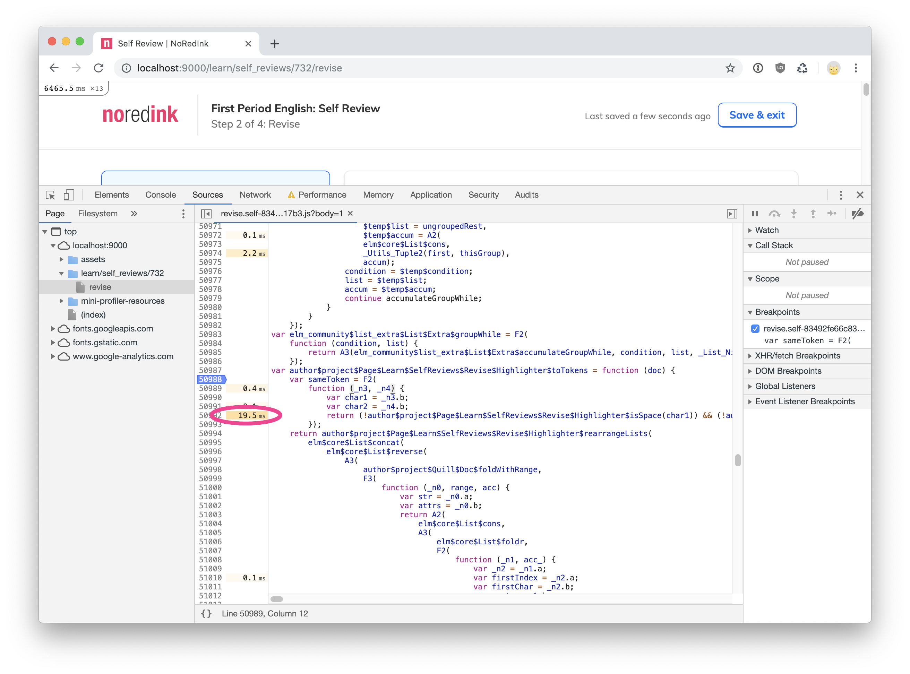

You have written your first application in Elm. Congratulations my friend,
the hard work has finally paid off. Now it's time to relax and enjoy the
pure bliss that is maintaining and refactoring Elm code.

But wait a second, someone tells you the app feels a bit sluggish to use.
Mh. I thought that writing pure functions would automatically make code
fast. Okay. Let's try to stay calm.

The app looks fast at a first glance. To be fair, you're probably using a
quad-core machine with 16 GB of RAM. Maybe you should see how the app
behaves on a lower end device. In Chrome, you bring up the inspector, then
go to Performance tab and choose how much you want to throttle your CPU.


When you click around the app now, you can clearly see it's quite sluggish.
Mh. Time to unleash the power of the flamegraph. You can start recording a
session, then click around the app as a normal user would. Easy peasy. When
all is done, you should see something like this.


That looks quite exotic, but let's not lose hope. The <span
style="background-color: #f3d07c;">yellow parts</span> of the graph
represent the time your browser spent executing scripts, while the <span
style="background-color: #ae99eb;">purple parts</span> denote the time it
took to render. You can also see small red corners scattered through the
graph: those represent when the user has experienced noticeable delays
while using the application. You can find out more information about what
it means
[here](https://developers.google.com/web/fundamentals/performance/rail#goals-and-guidelines "Measure Performance with the RAIL Model").

You'll also notice you can select a smaller time interval and start digging
into more specific bits of what your application is doing at a certain
time. For example, if you highlight the first big chunk of scripting and
then look in the lower panel, you will find a tab named "Bottom-Up".


The first entry says `_Utils_eqHelp`, and apparently that function took the
most time to execute. This is curious, because we don't expect our
application to spend so much time comparing things. By clicking on the
right hand side, we will be able to see which module is the cause of this
performance problem.



As you can see, the function causing slowdown seems to be the aptly named
`author$project$Page$Learn$SelfReviews$Revise$Highlighter$isSpace`. Let's
look at what that function does:

```elm
isSpace : Char -> Bool
isSpace char =
    List.member char
        [ ' '
        , '\t'
        , '\n'
        , '\u{000D}'

        -- what follows is a list of unicode characters used
        -- as spaces: http://jkorpela.fi/chars/spaces.html
        , '\u{00A0}'
        , '\u{1680}'
        , '\u{180E}'
        , '\u{2000}'
        , '\u{2001}'
        , '\u{2002}'
        , '\u{2003}'
        , '\u{2004}'
        , '\u{2005}'
        , '\u{2006}'
        , '\u{2007}'
        , '\u{2008}'
        , '\u{2009}'
        , '\u{200A}'
        , '\u{200B}'
        , '\u{202F}'
        , '\u{205F}'
        , '\u{3000}'
        , '\u{FEFF}'
        ]
```

Uh! That is really surprising. Usually iterating over a list is really
fast, but in this case it seems that we are spending almost 90% of our
time inside this function. As you probably know, the algorithmic complexity
of iterating over a list is _O(n)_: we could easily improve that by
building a set that contains all the desired characters and checking
if the current character is part of that set. The Elm standard library
implements a set using a dict, which is in turn implemented using a
red-black tree, which means that the time complexity will become
_O(log(n))_.

So we can change the code that looked like this

```elm
sameToken ( _, char1 ) ( _, char2 ) =
    not (isSpace char1) && not (isSpace char2)
```

into something that looks like this

```elm
-- This is a very hot path in the code. So we build a set once
-- and use it to determine if a character is a space or not.

spaceSet =
    Set.fromList spaceCharacters

sameToken ( _, char1 ) ( _, char2 ) =
    not (Set.member char1 spaceSet) &&
      not (Set.member char2 spaceSet)
```

With this little change in place, we can repeat the performance
measurement


Now our browser is spending most of its time adding elements to the DOM
instead of just comparing things. We can also notice that there is no huge
outlier anymore: the current top function, `appendChild`, uses 15% of the
total time while previously `_Utils_eqHelp` was taking almost 90% of the
total time. When we try clicking around the application, we notice an
extreme performance speedup when using the application. Albeit this is
still not optimal, it's a **huge** improvement with a very small code
change. Look at how the shape of the performance graph has changed:


I hope that after reading this you will be less intimidated to dive in
performance measurements and get the most out of your browser inspector. In
future blog posts we will explore what else we can do to make our Elm
applications faster, in particular using `Html.Keyed` and `Html.Lazy`.
