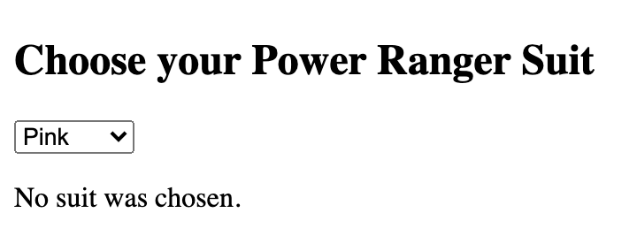

When writing Elm, it's very common to use [custom
types](https://guide.elm-lang.org/types/custom_types.html) to structure
your data. Let's say we want to describe the flashy suits of the [Power
Rangers](https://en.wikipedia.org/wiki/Power_Rangers), as featured in the
1975 classic [Himitsu Sentai
Gorenger](https://en.wikipedia.org/wiki/Himitsu_Sentai_Gorenger):

```elm
type Suit
    = Green
    | Yellow
    | Red
    | Blue
```

This looks great, so we decide to go to the next level. We're going to
build a fully-fledged Elm application to choose our favourite Power Ranger
suit color. We start with a simple model:

```elm
type alias Model =
    { chosenSuit : Maybe Suit }
```

We then define an initial state of the model, where no suit has been chosen:

```elm
initialModel : Model
initialModel =
    { chosenSuit = Nothing }
```

Now we can write a view function to display something:

```elm
import Html exposing (Html, div, text)
import Html.Attributes as Attrs

view : Model -> Html Msg
view model =
    div []
        [ Html.h2 [] [ text "Choose your Power Ranger Suit" ]
        , Html.select []
            [ Html.option
                [ Attrs.value "" ]
                [ text "Choose" ]
            , Html.option
                [ Attrs.value "Green" ]
                [ text "Green" ]
            , Html.option
                [ Attrs.value "Yellow" ]
                [ text "Yellow" ]
            , Html.option
                [ Attrs.value "Red" ]
                [ text "Red" ]
            , Html.option
                [ Attrs.value "Blue" ]
                [ text "Blue" ]
            ]
        ]
```

This is unfortunate. We have to use strings and pass them to `Attrs.value`
and to `Html.text`, which means we can't use the beautiful custom type we
wrote above. To be able to do that, we have to define a `toString` function:

```elm
toString : Suit -> String
toString suit =
    case suit of
        Green ->
            "Green"

        Yellow ->
            "Yellow"

        Red ->
            "Red"

        Blue ->
            "Blue"
```

And use it to dry up the view:

```elm
selectOptions : List (Html Msg)
selectOptions =
    List.map
        (\color ->
            Html.option
                [ Attrs.value (toString color) ]
                [ text (toString color) ]
        )
        [ Green, Yellow, Red, Blue ]

view : Model -> Html Msg
view model =
    div []
        [ Html.h2 [] [ text "Choose your Power Ranger Suit" ]
        , Html.select []
            (Html.option [ Attrs.value "" ] [ text "Choose" ]
                :: selectOptions
            )
        ]
```

You can play around with this [Ellie app](https://ellie-app.com/cDq7YCwvfpBa1)
to see how that looks like.

If you're a bit more experienced with Elm, you will notice that you can
choose an option in the select, but that won't update the `Model`.
Let's prove that assumption by changing the view to:

```elm
view : Model -> Html Msg
view model =
    div []
        [ Html.h2 [] [ text "Choose your Power Ranger Suit" ]
        , Html.select []
            (Html.option [ Attrs.value "" ] [ text "Choose" ]
                :: selectOptions
            )
        , Html.p []
            [ case model.chosenSuit of
                Nothing ->
                    text "No suit was chosen."

                Just suit ->
                    text ("Your choice: " ++ toString suit)
            ]
        ]
```

As you can see, no matter how you change the view, the value won't be
updated. This happens because we haven't defined a `onInput` event on the
select :(

```elm
import Html.Events as Events

view : Model -> Html Msg
view model =
    div []
        [ Html.h2 [] [ text "Choose your Power Ranger Suit" ]
        , Html.select [ Events.onInput ChooseSuit ]
            (Html.option [ Attrs.value "" ] [ text "Choose" ]
                :: selectOptions
            )
        , Html.p []
            [ case model.chosenSuit of
                Nothing ->
                    text "No suit was chosen."

                Just suit ->
                    text ("Your choice: " ++ toString suit)
            ]
        ]

type Msg
    = ChooseSuit String

update : Msg -> Model -> Model
update msg model =
    case msg of
        ChooseSuit value ->
            { model | chosenSuit = fromString value }
```

What's that `fromString` function? Here it is:

```elm
fromString : String -> Maybe Suit
fromString str =
    case str of
        "Green" ->
            Just Green

        "Yellow" ->
            Just Yellow

        "Red" ->
            Just Red

        "Blue" ->
            Just Blue

        _ ->
            Nothing
```

In this [Ellie app](https://ellie-app.com/cDqjV9LLFX6a1), we can see
that everything is working nicely :)

## An interesting pair

We notice a terrible bug in our application: we forgot about the Pink
Power Ranger! Let's fix that by adding a new variant:

```elm
type Suit
    = Green
    | Yellow
    | Red
    | Blue
    | Pink
```

If we save the file, we'll notice the Elm compiler being helpful as ever:

```elm
This `case` does not have branches for all possibilities:

19|>    case suit of
20|>        Green ->
21|>            "Green"
22|>
23|>        Yellow ->
24|>            "Yellow"
25|>
26|>        Red ->
27|>            "Red"
28|>
29|>        Blue ->
30|>            "Blue"

Missing possibilities include:

    Pink
```

Cool, we need to add the missing case in `toString`:

```elm
toString : Suit -> String
toString suit =
    case suit of
        Green ->
            "Green"

        Yellow ->
            "Yellow"

        Red ->
            "Red"

        Blue ->
            "Blue"

        Pink ->
            "Pink"
```

If we save now the app compiles. But if we try using the app, we can see
that there is no `Pink` option :( It turns out we forgot to add the option
inside the `selectOptions` function. Maybe we can also extract the list of
suits into another function:

```elm
allSuits : List Suit
allSuits =
    [ Green, Yellow, Red, Blue, Pink ]

selectOptions : List (Html Msg)
selectOptions =
    List.map
        (\color ->
            Html.option
                [ Attrs.value (toString color) ]
                [ text (toString color) ]
        )
        allSuits
```

Try the [app](https://ellie-app.com/cDqsN2T5bSma1) now. This is what
happens when you choose 'Pink' in the dropdown:



This makes me sad, since I love to repeat:

> If it compiles, it works

And in the last minute we already bumped into two cases where the code
compiles, but doesn't work. As you probably guessed, the bug is hidden in
our `fromString` function:

```elm
fromString : String -> Maybe Suit
fromString str =
    case str of
        "Green" ->
            Just Green

        "Yellow" ->
            Just Yellow

        "Red" ->
            Just Red

        "Blue" ->
            Just Blue

        "Pink" ->
            Just Pink

        _ ->
            Nothing
```

This is the key difference between the `toString` function and the
`fromString` function: `toString` takes a `Suit`, so the compiler can warn
us if we forget to consider one of the possible alternatives. In the case
of `fromString`, the valid inputs are **all possible strings**, so the
compiler can't do much to warn us.

But as humans, we can tell that these two functions are _really_ similar.
Is there nothing we can do to express it in code? Let's go for a little trip.

## A trip in Haskell Land

Let's define the same type in Haskell:

```haskell
data Suit
  = Green
  | Yellow
  | Red
  | Blue
  | Pink
```

In order to implement the `toString` function we can derive the `Show`
typeclass, which will know how to convert our custom type to a string:

```haskell
data Suit
  = Green
  | Yellow
  | Red
  | Blue
  | Pink
  deriving (Show)

toString :: Suit -> String
toString = show
```

And we take it for a spin:

```haskell
Prelude> toString Green
"Green"

Prelude> toString Blue
"Blue"

Prelude> toString Pink
"Pink"
```

Now let's figure out a way to define the `fromString` function. We can
start by defining an `allSuits` function. We will do so by deriving other
two typeclasses, named `Enum` and `Bounded`. The first one tells the
compiler that our type is an enumeration of sequentially ordered types,
while the second specifies that our type has a minimum value and a maximum
value.

```haskell
data Suit
  = Green
  | Yellow
  | Red
  | Blue
  | Pink
  deriving (Show, Enum, Bounded)

allSuits :: [Suit]
allSuits =
  [minBound .. maxBound]
```

Which results in:

```haskell
Prelude> allSuits
[Green, Yellow, Red, Blue, Pink]
```

Cool! Now we can write that `fromString` function:

```haskell
import qualified Data.Map as Map

suitMap :: Map.Map String Suit
suitMap =
  Map.fromList $
    map
      (\suit -> (toString suit, suit))
      allSuits

fromString :: String -> Maybe Suit
fromString value =
  Map.lookup value suitMap
```

Here it is working:

```haskell
Prelude> fromString "Red"
Just Red

Prelude> fromString "Pink"
Just Pink

Prelude> fromString "Geronimo"
Nothing
```

As you can see, in Haskell Land we were able to define the relationship
between `toString` and `fromString`. If we add a new variant to the `Suit`
type, it will be picked up and everything will work as intended. This
technique is described in more detail in the wonderful [Haskell
Mini-Patterns
Handbook](https://kowainik.github.io/posts/haskell-mini-patterns#bidirectional-parsing).

## Coming back home

Is there a way to achieve something similar in Elm?

Yes, there is! 🍨

Truth be told, we can't do _exactly_ what Haskell does, but we can _emulate_ Haskell's behaviour by using a wonderful library called [elm-review](https://package.elm-lang.org/packages/jfmengels/elm-review/latest/).

`elm-review` analyzes your Elm code and reports patterns that violate
certain rules. We can use it to enforce additional guarantees on our
projects, such as removing unused functions, unused values, unused modules,
and unused dependencies. You can read more about it
[here](https://jfmengels.net/announcing-elm-review) and
[here](https://jfmengels.net/safe-dead-code-removal).

In our case, we can write a rule that detects functions named like
`allSuits` and tell it to warn us when we forget to include a type
constructor. I've shamefully stolen a [gist](https://gist.github.com/jfmengels/e1fd40af3d0e7bde707c0241bf46920f) from Jeroen Engels and pushed it
as an elm-review package
[here](https://github.com/Arkham/elm-review-no-missing-type-constructor).

If you'd like to follow along you can pull [this repo](https://github.com/Arkham/elm-there-and-back-again) and then run:

```bash
$ npx elm-review --template \
  Arkham/elm-review-no-missing-type-constructor/example
✔ Fetching template information
-- ELM-REVIEW ERROR ------------------- src/Main.elm:46:1

NoMissingTypeConstructor: `allSuits` does not contain all
the type constructors for `Suit`

45| allSuits : List Suit
46| allSuits =
    ^^^^^^^^
47|     [ Green, Yellow, Red, Blue ]

We expect `allSuits` to contain all the type constructors
for `Suit`.

In this case, you are missing the following constructors:
, Pink

I found 1 error in 1 file.
```

🎉 🎉 🎉

Now we can implement a solution which is very similar to the Haskell one!

```elm
import Dict exposing (Dict)

suitDict : Dict String Suit
suitDict =
    Dict.fromList <|
        List.map
            (\suit -> ( toString suit, suit ))
            allSuits

fromString : String -> Maybe Suit
fromString value =
    Dict.get value suitDict
```

Now when we add a new variant of `Suit`, the Elm compiler will nudge us to
update `toString`, while elm-review will nudge us to add the missing
variant to `allSuits`, which in turn is going to make sure that `toString`
and `fromString` will never go out of sync. Here's a link to the [final
version](https://ellie-app.com/cDrHpYTXsr9a1) of the code for you to
peruse.

Thanks for reading! 👋
