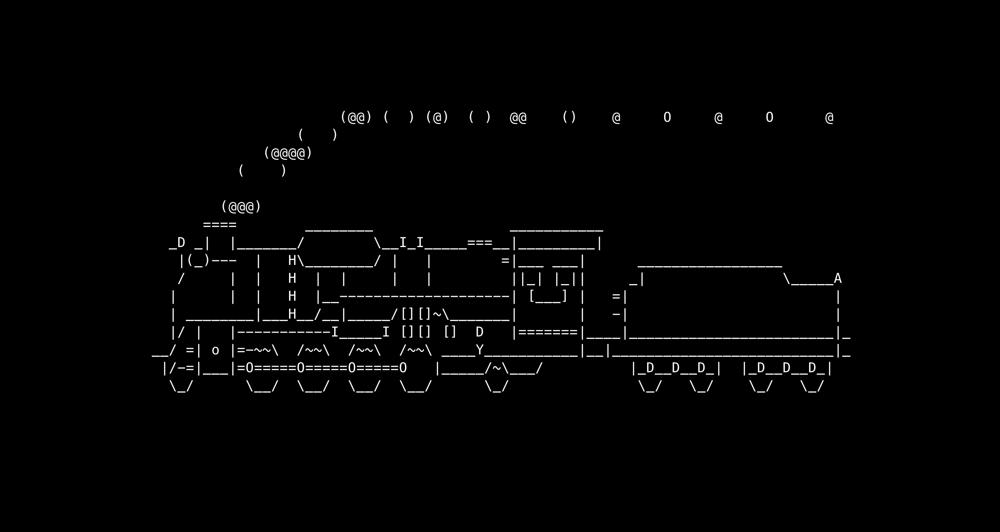
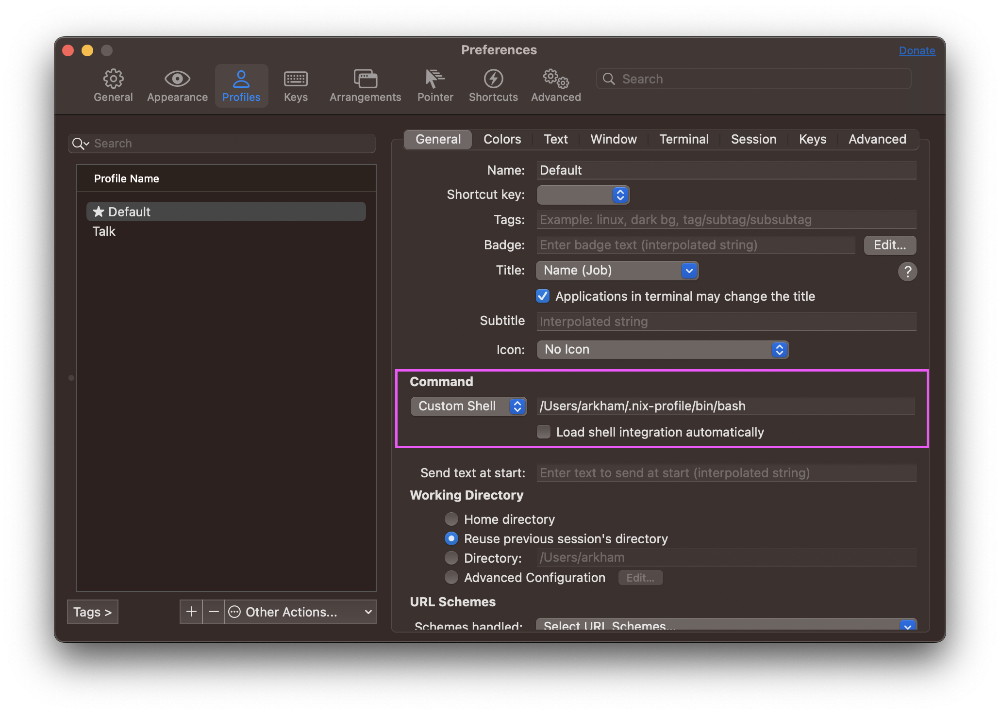

I have four machines I often use:

- a 2022 M1 Macbook, my work laptop
- a 2017 Intel Macbook, my personal laptop
- a 2011 iMac, my... music player
- a Raspberry Pi 3, my [ad blocker](https://pi-hole.net/)

I'd like to have the same development environment on all of these machines,
mostly for my bash, git, vim, and tmux configs. I'd also like to be able to
use all the nice little utilities I'm used to, such as:

- [fzf](https://github.com/junegunn/fzf) to fuzzy search _everything_
- [exa](https://github.com/ogham/exa) as a replacement for `ls`
- [ripgrep](https://github.com/BurntSushi/ripgrep) to search for stuff
- [zoxide](https://github.com/ajeetdsouza/zoxide) as a smarter `cd`
- [delta](https://github.com/dandavison/delta) for viewing diffs

As many of us do, I used to have a repo with a scrappy script that would
symlink all my configuration files and install a list of packages via
homebrew or apt.

Except that it would often break. For example, I would install a vim plugin
that depends on Ruby: at install time, the plugin would be dynamically
linked against the existing version of Ruby. Whenever I updated Ruby, the vim
plugin would then start crashing. The fix? Reinstall the vim plugin so it
would be dynamically linked against the correct version of Ruby. I had to
do this every time I updated Ruby.
[Ugh](https://github.com/wincent/command-t/issues/350)!

Oh, remember my old iMac from 2011? Apparently, it's so old that homebrew
stopped supporting it. Many times you won't be able to find bottled
versions of programs and you'll have to compile them from source, which
takes _ages_. And sometimes the compilation crashes with random errors. It
seems I'm out of luck and I should give up, even though it's a perfectly
functioning machine. Should I try to install Linux on it?

It would be great if there was a way to provision a development environment
that worked on all of my machines, even the ones which are a bit obsolete.

## Oh, but there is

I've already written about [Nix](/ditch-your-version-manager), so feel
free to go and read that one first. Don't feel like it? _Fine_.

Let's install it:

```bash
$ sh <(curl -L https://nixos.org/nix/install)
```

This should work now:

```bash
$ nix-env --version
nix-env (Nix) 2.13.2
```

I'm going to make you enable a feature called [Nix
flakes](https://www.tweag.io/blog/2020-05-25-flakes/), which we'll use to
lock the versions of our dependencies.

```bash
$ mkdir -p ~/.config/nix

$ cat <<EOF >> ~/.config/nix/nix.conf
experimental-features = nix-command flakes
EOF
```

In order to get Nix to pick this up we need to restart the Nix daemon:

```bash
$ sudo launchctl kickstart -k system/org.nixos.nix-daemon
```

Great! Now we can create the folder to store all our configs:

```bash
$ mkdir -p ~/.config/nixpkgs && cd ~/.config/nixpkgs
```

We are going to create a file called `flake.nix`, where we'll define some
inputs and some outputs. The inputs are going to be:

- [nixpkgs](https://github.com/NixOS/nixpkgs), the repository of all nix packages
- [home-manager](https://github.com/nix-community/home-manager), the tool to manage your env

What is going to be the output? Our dev environment :)

```nix{13,18}
{
  description = "Home Manager configuration";

  inputs = {
    nixpkgs.url = "github:nixos/nixpkgs/nixpkgs-unstable";
    home-manager = {
      url = "github:nix-community/home-manager";
      inputs.nixpkgs.follows = "nixpkgs";
    };
  };

  outputs = { nixpkgs, home-manager, ... }: let
    arch = "x86_64-darwin"; # or aarch64-darwin
  in {
    defaultPackage.${arch} =
      home-manager.defaultPackage.${arch};

    homeConfigurations.YOUR_USER = # REPLACE ME
      home-manager.lib.homeManagerConfiguration {
        pkgs = nixpkgs.legacyPackages.${arch};
        modules = [ ./home.nix ];
      };
    };
}
```

Just be sure to choose the right architecture for your system,
`x86_64-darwin` for Intel Macs and `aarch64-darwin` for ARM Macs. Later I'm
going to explain how to support multiple architectures. Oh, and also make
sure to put your username instead of `YOUR_USER` 🙏

You can see that we include a file called `home.nix`, which doesn't
exist yet. Let's create it:

```nix{2,3}
{ pkgs, ... }: {
  home.username = "YOUR_USER"; # REPLACE ME
  home.homeDirectory = "/Users/YOUR_USER"; # REPLACE ME
  home.stateVersion = "22.11";
  programs.home-manager.enable = true;
}
```

Before we can try it out, flakes require all config files to be in a Git repository:

```bash
git init && git add .
```

Perfect, now we're ready to go:

```bash
nix run . switch
```

This command will install `nixpkgs-unstable` and `home-manager`, lock their versions in
a `flake.lock` file, and enable the first generation of our dev
environment. When it completes, we can check that it has been installed
correctly:

```bash
$ home-manager --version
22.11
```

Hurray! 🎆

## Adding packages

Let's modify our `home.nix` so that it looks like this:

```nix{7-9}
{ pkgs, ... }: {
  home.username = "arkham";
  home.homeDirectory = "/Users/arkham";
  home.stateVersion = "22.11";
  programs.home-manager.enable = true;

  home.packages = [
    pkgs.sl
  ];
}
```

If we run `home-manager switch`, we'll be greeted with an output like this
one:

```bash
$ home-manager switch
Starting Home Manager activation
Activating checkFilesChanged
Activating checkLaunchAgents
Activating checkLinkTargets
Activating writeBoundary
Activating copyFonts
Activating installPackages
replacing old 'home-manager-path'
installing 'home-manager-path'
building '/nix/store/vj49hfv01fdgwd3igl9pi1kz4rlmj6x5-user-environment.drv'...
Activating linkGeneration
Cleaning up orphan links from /Users/arkham
Creating profile generation 2
Creating home file links in /Users/arkham
Activating onFilesChange
Activating setupLaunchAgents
```

Now we can run:

```bash
$ sl
```

And we'll see something like this chugging along:



CHOO CHOO! 🚂 Notice that we downloaded a precompiled version of `sl`,
which is very similar to the bottled programs that homebrew provides. No
compilation needed! You can search
[here](https://search.nixos.org/packages?channel=unstable) for any package
you'd like to install.

If you're like me and love trains, you might already be satisfied. If you
want to see how `home-manager` manages both programs and configuration files,
keep on reading.

Let's go back inside `~/.config/nixpkgs` and copy our git config:

```bash
$ cd ~/.config/nixpkgs

$ cp -L ~/.gitconfig gitconfig
```

And change `home.nix` to look like this:

```bash{11-14}
{ pkgs, ... }: {
  home.username = "arkham";
  home.homeDirectory = "/Users/arkham";
  home.stateVersion = "22.11";
  programs.home-manager.enable = true;

  home.packages = [
    pkgs.sl
  ];

  programs.git = {
    enable = true;
    includes = [{ path = "~/.config/nixpkgs/gitconfig"; }];
  };
}
```

You'll see that we specified that we want `programs.git` to be enabled. In
this way home-manager can install the program and manage its configuration
at the same time. As a rule of thumb, if it's supported by home-manager
I'll install the program using `programs.<program>`. If not, I'll add it to
`home.packages`.

If we run `home-manager switch -b bak`, we'll notice some things:

- the old config has been backed up as `~/.gitconfig.bak`
- but now `~/.gitconfig` doesn't exist anymore
- yet somehow, still, our git settings are working

This is because home-manager stores the git configuration inside
`~/.config/git/config`. If we look at that path we'll be surprised:

```bash
$ ls -al ~/.config/git/config
lrwxr-xr-x 1 arkham staff 81 Feb 12 00:01 /Users/arkham/.config
/git/config -> /nix/store/mcnp2v50ndgxvkis1labl6784r8qwbj8-home
-manager-files/.config/git/config
```

Our config file is _read-only_ and is a link to an obscure path in the
`/nix/store`. Home-manager does this to ensure that you don't accidentally
edit your generated config files, since your changes would be overridden
next time you run `home-manager switch`.

Ready to try something else? Let's remove the homebrew copy of git:

```bash
$ brew uninstall git
```

You'll notice that `git` is still working:

```bash
$ which git
/Users/arkham/.nix-profile/bin/git

$ ls -al $(which git)
lrwxr-xr-x 69 root  1 Jan  1970 /Users/arkham/.nix-profile/bin/
git -> /nix/store/ampvjly5y69drxcxyipjfzk2xghwn94i-home-manager
-path/bin/git
```

Oh god, these symlinks are EVERYWHERE.

## Bring on the heat

Now we're going to do the unthinkable. We're going to move our precious
shell configuration inside `home-manager`. _Yes_.

First let's make sure we are in the right directory:

```bash
$ cd ~/.config/nixpkgs
```

I'm going to show you how to do it for Bash and Zsh. You can choose one:

```bash
$ cp -L ~/.bashrc bashrc
$ cp -L ~/.bash_profile bash_profile

$ cp -L ~/.zshrc zshrc
```

Now we can change our `home.nix`:

```nix{9, 17-26}
{ pkgs, ... }: {
  home.username = "arkham";
  home.homeDirectory = "/Users/arkham";
  home.stateVersion = "22.11";
  programs.home-manager.enable = true;

  home.packages = [
    pkgs.sl
    pkgs.bashInteractive # don't ask me why
  ];

  programs.git = {
    enable = true;
    includes = [{ path = "~/.config/nixpkgs/gitconfig"; }];
  };

  programs.bash = {
    enable = true;
    profileExtra = builtins.readFile ./bash_profile;
    initExtra = builtins.readFile ./bashrc;
  };

  programs.zsh = {
    enable = true;
    initExtra = builtins.readFile ./zshrc;
  };
}
```

Ready? Go! `home-manager switch -b bak` 😱

If you open a new shell, you'll see (_surprise!_) that everything is still
working, and all your customizations are still there. The only difference
is that those configuration files are now symlinks to the Nix store.

Note that by default your terminal will still run the shell provided by
the OS. In my terminal, I customized the starting shell to be the one
provided by Nix:



But what is the advantage of letting home-manager take care of those files?
Aren't those glorified symlinks after all?
Isn't it all pointless?

Let me show you _why_ this is VERY NICE.

Let's change our `home.nix` again:

```nix{28-39}
{ pkgs, ... }: {
  home.username = "arkham";
  home.homeDirectory = "/Users/arkham";
  home.stateVersion = "22.11";
  programs.home-manager.enable = true;

  home.packages = [
    pkgs.sl
    pkgs.bashInteractive
  ];

  programs.git = {
    enable = true;
    includes = [{ path = "~/.config/nixpkgs/gitconfig"; }];
  };

  programs.bash = {
    enable = true;
    profileExtra = builtins.readFile ./bash_profile;
    initExtra = builtins.readFile ./bashrc;
  };

  programs.zsh = {
    enable = true;
    initExtra = builtins.readFile ./zshrc;
  };

  programs.fzf = {
    enable = true;
  };

  programs.zoxide = {
    enable = true;
  };

  programs.direnv = {
    enable = true;
    nix-direnv.enable = true;
  };
}
```

`fzf`, `zoxide`, and `direnv` are programs that need to be hooked in your
shell. So normally you'd have to install the program and then edit your
shell config to load them up. Instead, home-manager will do that for you
now. Neat, right?

Have you noticed that last line that says `nix-direnv.enable = true`? That
single line will cache your direnv activated nix shells and make them super
fast. That's the advantage of using home-manager, you get all this stuff
for free, with only one line of code. Do you want a nicer diffing
experience in git? Enable [this
option](https://nix-community.github.io/home-manager/options.html#opt-programs.git.delta.enable)
in your `programs.git` block and you're done. Do you want fzf and tmux to
work nicer together? Enable this [other
option](https://nix-community.github.io/home-manager/options.html#opt-programs.fzf.tmux.enableShellIntegration)
and you're set.

[This page](https://mipmip.github.io/home-manager-option-search/) is
very useful to look at which programs are included in home-manager and
which options are supported. You can view the same information locally by
running:

```bash
$ man home-configuration.nix
```

You can also check my Nix configuration on
[Github](https://github.com/Arkham/dotfiles.nix) for inspiration.

### I like this. What do I do next?

You can start by moving more and more packages from homebrew to
home-manager. Take it easy, as they can coexist peacefully. For example,
you could check out:

- how to port your [git](https://github.com/Arkham/dotfiles.nix/blob/ba85362abf3a442b327d0b8fbb4691de5649cf40/git.nix) configuration
- how to port your
  [vim](https://github.com/Arkham/dotfiles.nix/blob/ba85362abf3a442b327d0b8fbb4691de5649cf40/vim.nix) configuration
- how to port your
  [bash](https://github.com/Arkham/dotfiles.nix/blob/ba85362abf3a442b327d0b8fbb4691de5649cf40/rest.nix#L9-L40) configuration

### How do I update all my packages?

Go inside `~/.config/nixpkgs` and run

```bash
$ nix flake update

$ home-manager switch
```

### How do I manage multiple machines with different architectures?

Check out [this
section](https://github.com/Arkham/dotfiles.nix/blob/ba85362abf3a442b327d0b8fbb4691de5649cf40/flake.nix#L18-L38) of my `flake.nix`. You can create multiple blocks where
`homeConfigurations` is followed by `YOUR_USER@YOUR_HOSTNAME`. Remember you
can always find your user with `whoami` and your hostname with `hostname`.
As you can see, I've extracted the shared configuration inside a `withArch` helper
function.

### How do I manage multiple machines with different setups?

The easiest way is to have multiple `home.nix` files, one for each machine:

```nix{18,25}
{
  description = "Home Manager configuration";

  inputs = {
    nixpkgs.url = "github:nixos/nixpkgs/nixpkgs-unstable";
    home-manager = {
      url = "github:nix-community/home-manager";
      inputs.nixpkgs.follows = "nixpkgs";
    };
  };

  outputs = { nixpkgs, home-manager, ... }: {
    defaultPackage = {
      "x86_64-darwin": home-manager.defaultPackage.x86_64-darwin;
      "aarch64-darwin": home-manager.defaultPackage.aarch64-darwin;
    };

    homeConfigurations."alice@wonderland" =
      home-manager.lib.homeManagerConfiguration {
        pkgs = nixpkgs.legacyPackages.x86_64-darwin;
        modules = [ ./home-alice.nix ];
      };
    };

    homeConfigurations."bob@bikinibottom" =
      home-manager.lib.homeManagerConfiguration {
        pkgs = nixpkgs.legacyPackages.aarch64-darwin;
        modules = [ ./home-bob.nix ];
      };
    };
}
```

Then in each file you can share modules, helper functions, or whatever your
heart desires.

### I don't want to use unstable software. How do I use the stable version?

In your `flake.nix` do this in your `inputs` block:

```nix{4-10}
{
  description = "Home Manager configuration";

  inputs = {
    nixpkgs.url = "github:nixos/nixpkgs/nixpkgs-21.11-darwin";
    home-manager = {
      url = "github:nix-community/home-manager/release-22.11";
      inputs.nixpkgs.follows = "nixpkgs";
    };
  };

  outputs = { nixpkgs, home-manager, ... }: let
    arch = "x86_64-darwin"; # or aarch64-darwin
  in {
    defaultPackage.${arch} =
      home-manager.defaultPackage.${arch};

    homeConfigurations.YOUR_USER = # REPLACE ME
      home-manager.lib.homeManagerConfiguration {
        pkgs = nixpkgs.legacyPackages.${arch};
        modules = [ ./home.nix ];
      };
    };
}
```

### I've changed my mind. How do I get both stable and unstable?

In your `flake.nix` do this:

```nix{4-13,15,26-28}
{
  description = "Home Manager configuration";

  inputs = {
    nixpkgs.url = "github:nixos/nixpkgs/nixpkgs-21.11-darwin";
    home-manager = {
      url = "github:nix-community/home-manager/release-22.11";
      inputs.nixpkgs.follows = "nixpkgs";
    };
    nixpkgs-unstable = {
      url = "github:nixos/nixpkgs/nixpkgs-unstable";
    };
  };

  outputs = { nixpkgs, nixpkgs-unstable, home-manager, ... }:
    let
      arch = "x86_64-darwin"; # or aarch64-darwin
    in {
      defaultPackage.${arch} =
        home-manager.defaultPackage.${arch};

      homeConfigurations.YOUR_USER = # REPLACE ME
        home-manager.lib.homeManagerConfiguration {
          pkgs = nixpkgs.legacyPackages.${arch};
          modules = [ ./home.nix ];
          extraSpecialArgs = {
            pkgs-unstable = nixpkgs-unstable.legacyPackages.${arch};
          };
        };
    };
}
```

Then in your `home.nix` you can do:

```nix{1,9}
{ pkgs, pkgs-unstable, ... }: {
  home.username = "arkham";
  home.homeDirectory = "/Users/arkham";
  home.stateVersion = "22.11";
  programs.home-manager.enable = true;

  home.packages = [
    pkgs.sl
    pkgs-unstable.cowsay
  ];
}
```

Now you can run:

```bash
$ cowthink "Nix is pretty neat."
 _____________________
( Nix is pretty neat. )
 ---------------------
        o   ^__^
         o  (oo)\_______
            (__)\       )\/\
                ||----w |
                ||     ||
```

### I need a config file which is unsupported. How do I symlink it into my home?

Move the file inside `~/.config/nixpkgs`:

```bash
$ mv .inputrc ~/.config/nixpkgs/inputrc
```

Then add a section like this to your `home.nix`:

```nix
home.file.".inputrc".source = ./inputrc;
```

If the config is very short you can also pass it inline:

```nix
home.file.".gemrc".text = "gem: --no-ri --no-rdoc";
```

### I've made a terrible mistake and screwed up my configs. Halp!

No big deal. Run:

```bash
$ home-manager generations
2023-02-14 20:59 : id 11 -> /nix/store/d8xwz7hik6i2iji4wl9py7p6rxn2vn56-home-manager-generation
2023-02-13 22:07 : id 10 -> /nix/store/sxgdyj9lbx496rczgn7rig2vkjly6nwj-home-manager-generation
2023-02-13 01:13 : id 9 -> /nix/store/wdllhq7pf0sghn3kb0w1hjqc9962i02j-home-manager-generation
2023-02-12 00:01 : id 8 -> /nix/store/fm9bg8phff5zm0hp3mp5safk9v6dgdrc-home-manager-generation
2023-02-11 19:28 : id 7 -> /nix/store/wdllhq7pf0sghn3kb0w1hjqc9962i02j-home-manager-generation
2023-02-11 18:59 : id 6 -> /nix/store/i6979nf0135r6qid4dpq2m3vmy177k1w-home-manager-generation
2023-02-11 18:01 : id 5 -> /nix/store/6iybn1scyl9yh0xb2scp4hfza65xnnfa-home-manager-generation
```

Each symlink points to an immutable copy of a previous home configuration.
Look at the timestamp, grab the Nix store path, append `/activate`, and run
it:

```bash
$ /nix/store/fm9bg8phff5zm0hp3mp5safk9v6dgdrc-home-manager-
generation/activate
Starting Home Manager activation
Activating checkFilesChanged
Activating checkLaunchAgents
Activating checkLinkTargets
Activating writeBoundary
Activating copyFonts
Activating installPackages
replacing old 'home-manager-path'
installing 'home-manager-path'
Activating linkGeneration
Cleaning up orphan links from /Users/arkham
Creating profile generation 12
Creating home file links in /Users/arkham
Activating onFilesChange
Activating setupLaunchAgents
```

🎉 🎉 🎉

### Nix is taking a lot of space on my machine.

Unfortunately that is a side effect of the Nix philosophy of tracking **every**
dependencies' dependencies. You can remove programs that you installed in
the past by running:

```bash
$ nix-collect-garbage -d
```

### This is bad. How do I uninstall it?

Uninstall home-manager:

```bash
$ home-manager uninstall
```

Restore your backups in your home directory:

```bash
$ cd ~

$ mv .gitconfig.bak .gitconfig

$ mv .bashrc.bak .bashrc
$ mv .bash_profile.bak .bash_profile

$ mv .zshrc.bak .zshrc
```

Then follow [this
guide](https://nixos.org/manual/nix/stable/installation/installing-binary.html#macos)
to uninstall Nix.

### Is homebrew completely useless now?

No, I still use it to install casks. ⚰️

### Still reading?

Fun fact: this blog uses
[Nix flakes](https://github.com/Arkham/juliu.is/blob/main/flake.nix).

_Many thanks to the wonderful human beings that have read earlier versions
of this post: Pedro Piñera Buendía, Isaac Roldán, Fabrizio Monti, Andrew MacMurray,
Austin Erlandson, and Georges Boris._
