I've been writing software "for a living" for more than ten years. I'm
afraid I have to admit that, for more than ten years, I've been using
`z-index` without really understanding it.

`z-index` is a CSS property that is used to position elements above or
below one another. It's your weapon of choice if you have two overlapping
elements and you want to decide which one goes on top. It's quite useful
for modals, tooltips, banners, etc. You can set it to an integer and a
larger value will generally result in the element being rendered on top of
the rest.

That's pretty much all I knew about it.

Usually, this is great in software: _"Learn enough to be dangerous"_ they
say. But invariably I would find myself fighting with `z-index` and
spending hours trying to understand what is wrong with Life, the Universe,
and Everything.

I'm pretty sure it's not just me. It's common to bump into CSS like this:

> z-index: 99999

Which is pretty much the equivalent of the developer saying:

> this is too wild, byeee

Well, let's tackle this beast with some examples.

## The setup

I've created a [little app](https://z-index.juliu.is) to make things easy. It looks like this:

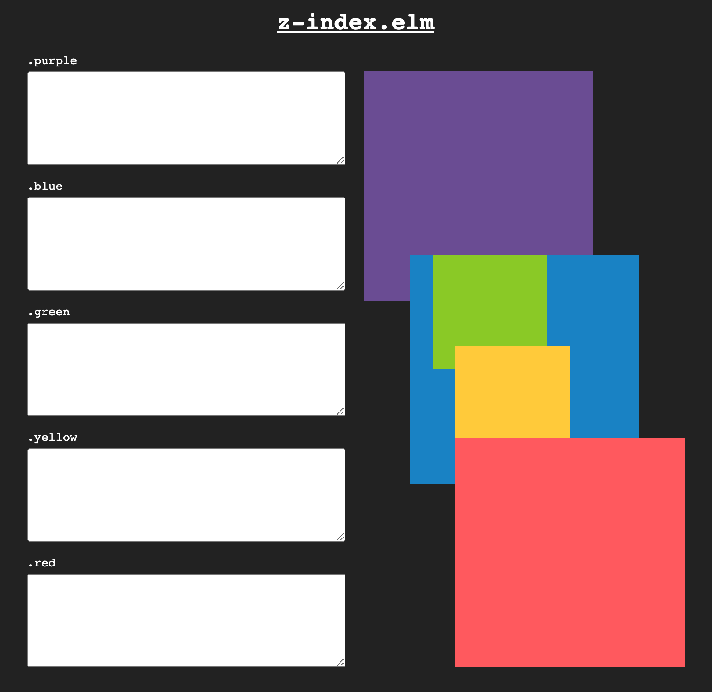

The boxes on the right are positioned statically. This is the default when
you don't specify a `position` property, therefore a statically positioned
box is also known as a **non-positioned** box. I've added some negative
margins so they overlap with one another.

On the left-hand side, you can type some styles which will be applied to
the boxes. Notice that you can also share the setup by copying the URL.
Let's get started now!

## Ordering matters

Here's the HTML that powers the page:

```html
<div class="purple"></div>
<div class="blue">
  <div class="green"></div>
  <div class="yellow"></div>
</div>
<div class="red"></div>
```

As you can see, ordering in the HTML matters. The red box is positioned
above the rest because it appears later in the code.

## z-index doesn't work by itself

Look at [this](https://z-index.juliu.is/?css=p%2Bz-index%3A%209999):

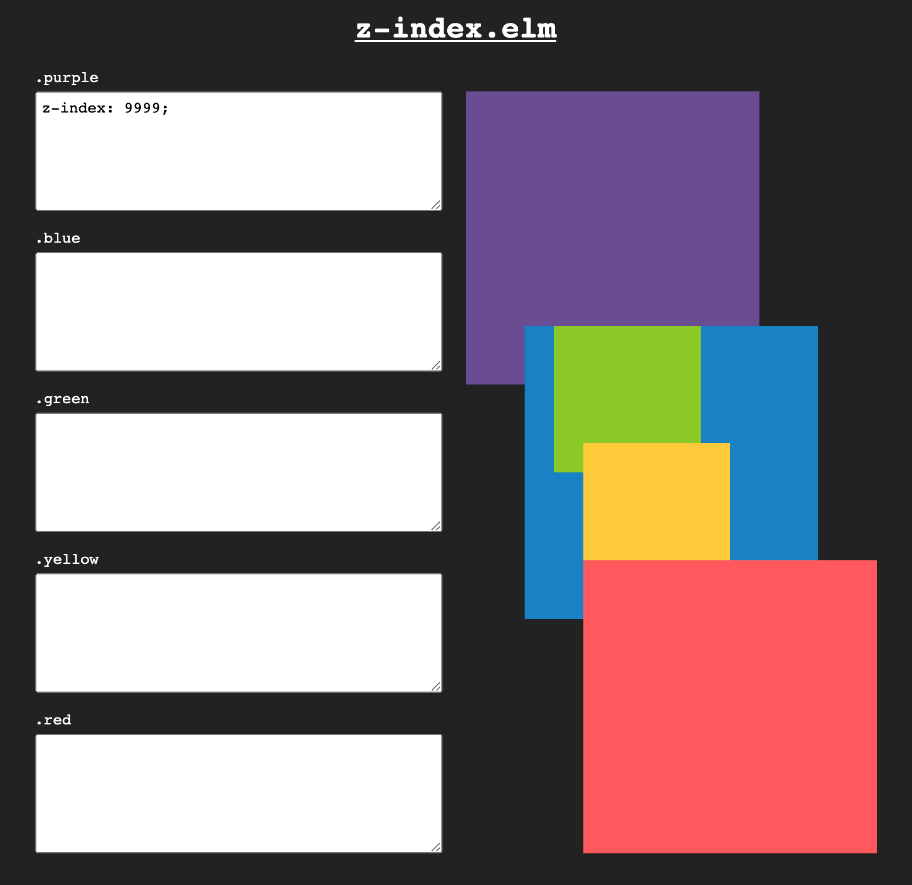

That's rule number one:

> z-index works only on positioned elements.

So `z-index` only works on elements that have a `position` property set to:

- `relative`
- `absolute`
- `fixed`
- `sticky`

[There](https://z-index.juliu.is/?css=p%2Bposition%3A%20relative%3Bz-index%3A%209999) we go:

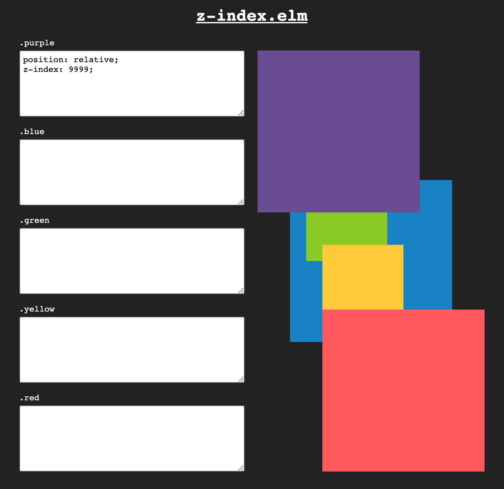

Would you be able to guess what happens when we remove the `z-index`
property from this example? Go on, I'll wait.

[This](https://z-index.juliu.is/?css=p%2Bposition%3A%20relative) is what we see:

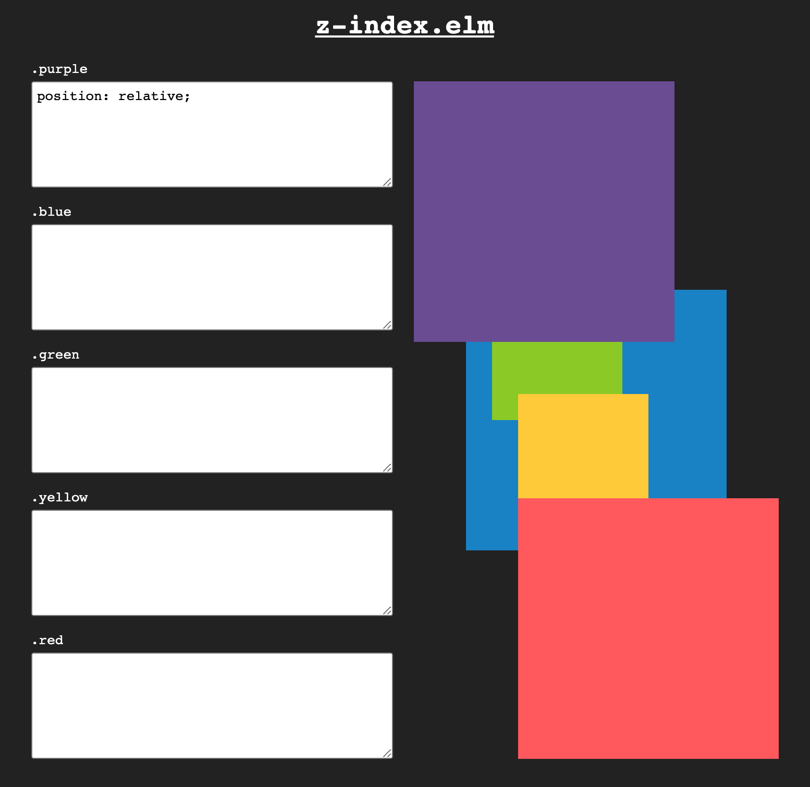

It turns out that positioned boxes appear on top of non-positioned boxes.
If you're inclined, the [spec](https://www.w3.org/TR/CSS2/zindex.html) goes
into **much** more detail.

But if all the boxes are positioned, we revert to following the order in
the HTML source. Look at
[this](https://z-index.juliu.is/?css=b%2Bposition%3A%20relative%7Cp%2Bposition%3A%20relative%7Cr%2Bposition%3A%20relative):

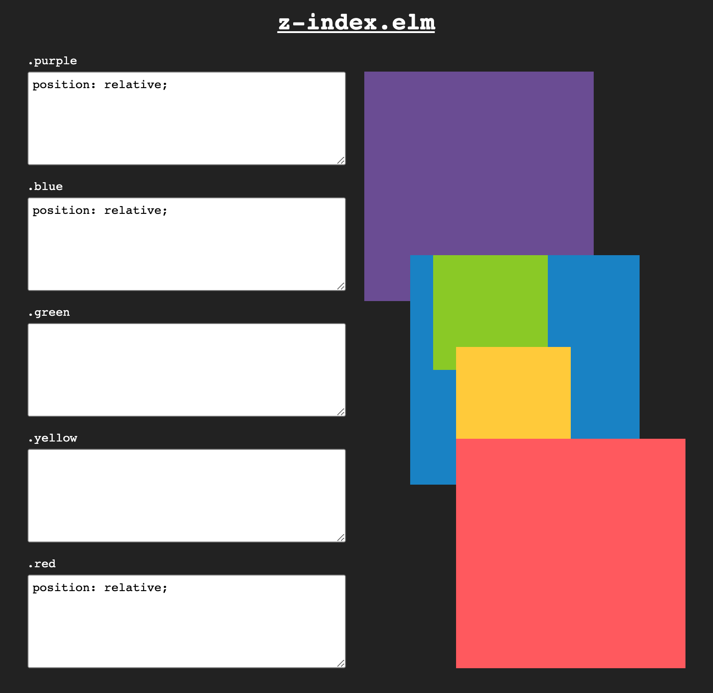

And at that point, specifying a `z-index` [does
work](https://z-index.juliu.is/?css=b%2Bposition%3A%20relative%3Bz-index%3A%201%7Cp%2Bposition%3A%20relative%3Bz-index%3A%202%7Cr%2Bposition%3A%20relative)!


Using the powers of `z-index` we were able to reverse the default stacking order of
the boxes. Go us.

## A new mystery

Let's look at [this
example](https://z-index.juliu.is/?css=b%2Bposition%3A%20relative%7Cr%2Bposition%3A%20relative%7Cy%2Bposition%3A%20relative%3Bz-index%3A%201%3Bheight%3A%20200px):

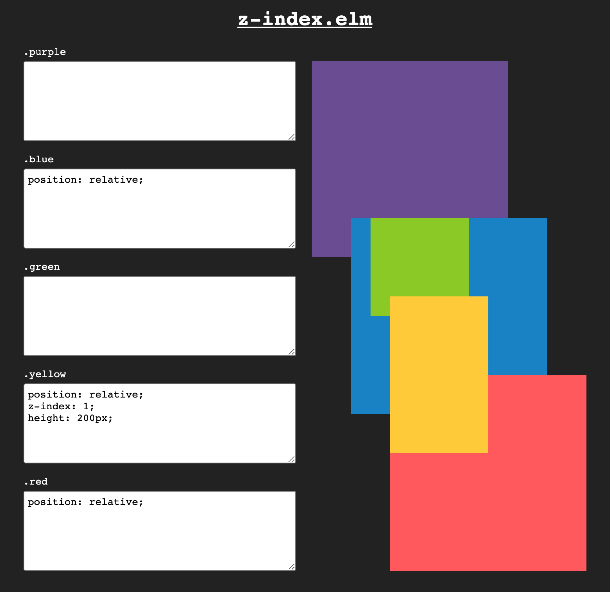

Out of the three positioned boxes, the yellow one has `z-index: 1`, and
therefore appears on top. Good, the world is making sense.

But what if we give a `z-index` to the blue box, the parent of the yellow box? Our
example would look like
[this](https://z-index.juliu.is/?css=b%2Bposition%3A%20relative%3Bz-index%3A%200%7Cr%2Bposition%3A%20relative%7Cy%2Bposition%3A%20relative%3Bz-index%3A%201%3Bheight%3A%20200px):

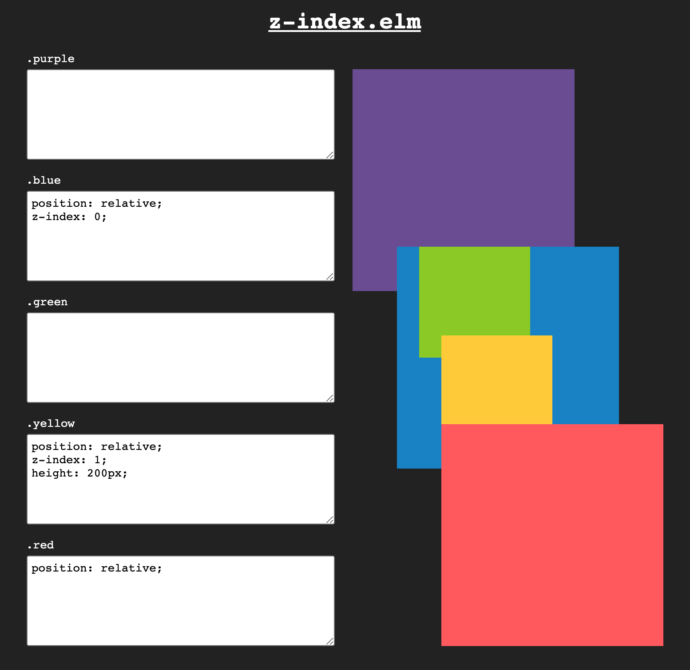

What's happening here? Our yellow box is now rendered below the red one?!
All this because we added a `z-index: 0` to the blue one?! The world is
making no sense again. 😿

Let's take a bit of a detour...

## Auto is not zero

If we don't set the `z-index` property of an element, its default value is
going to be `auto`. Such elements will appear in front of elements with
negative `z-index` values and below elements with positive `z-index`
values.
[This](https://z-index.juliu.is/?css=b%2Bposition%3A%20relative%7Cp%2Bposition%3A%20relative%3Bz-index%3A%201%7Cr%2Bposition%3A%20relative%3Bz-index%3A%20-1)
should convince you that I'm not lying:

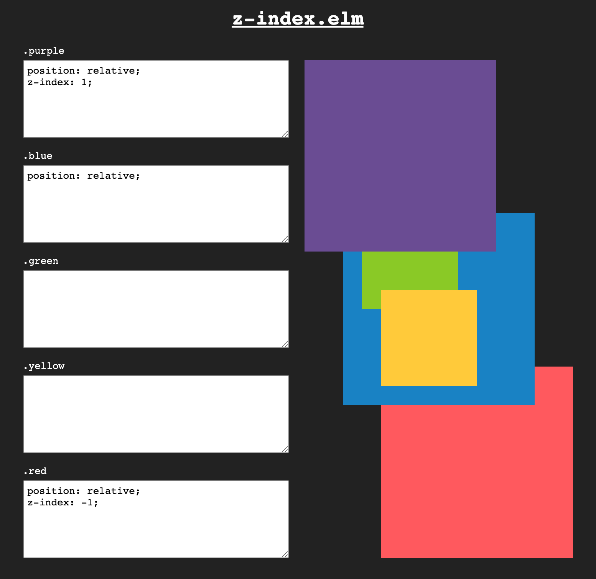

So in a way that element behaves as if we set `z-index: 0`. Indeed, if we
add that CSS rule, we see no notable changes in the
[output](https://z-index.juliu.is/?css=b%2Bposition%3A%20relative%3Bz-index%3A%200%7Cp%2Bposition%3A%20relative%3Bz-index%3A%201%7Cr%2Bposition%3A%20relative%3Bz-index%3A%20-1):


But things changed a lot! Giving a value to `z-index` to a relatively
positioned box creates a new **stacking context**.

A stacking what?
[MDN](https://developer.mozilla.org/en-US/docs/Web/CSS/CSS_Positioning/Understanding_z_index/The_stacking_context) says:

> The stacking context is a three-dimensional conceptualization of HTML
> elements along an imaginary z-axis relative to the user, who is assumed
> to be facing the viewport or the webpage. HTML elements occupy this space
> in priority order based on element attributes.

I thought this is what we were trying to do all along. Let's keep reading.

The interesting part comes later:

> Within a stacking context, child elements are stacked according to the
> same rules previously explained. Importantly, the z-index values of its
> child stacking contexts only have meaning in this parent.

That's the key point. A stacking context will force the `z-index` of its
child stacking contexts to only have a local meaning. Let's look at our
mysterious example again:


Setting `z-index: 0` on the blue box changed the meaning of the `z-index`
declaration on the yellow box. Before, the yellow box was out there playing
with the big boys. Now, it can only affect stacking within the blue box.

This is a great cause of frustration. No matter how high you set a
`z-index` property, you will _never_ be able to 'escape' the parent
stacking context.  And every time you are struggling with making `z-index`
work you can bet that it's because _something_ created a stacking context
that you can't escape from.

With this newfound understanding, spend some time explaining why [this
example](https://z-index.juliu.is/?css=b%2Bposition%3A%20relative%3Bz-index%3A%201%7Cg%2Bposition%3A%20relative%3Bz-index%3A%2010%7Cp%2Bposition%3A%20relative%3Bz-index%3A%202%7Cr%2Bposition%3A%20relative%7Cy%2Bposition%3A%20relative%3Bz-index%3A%205%3Bheight%3A%20200px) makes perfect sense:

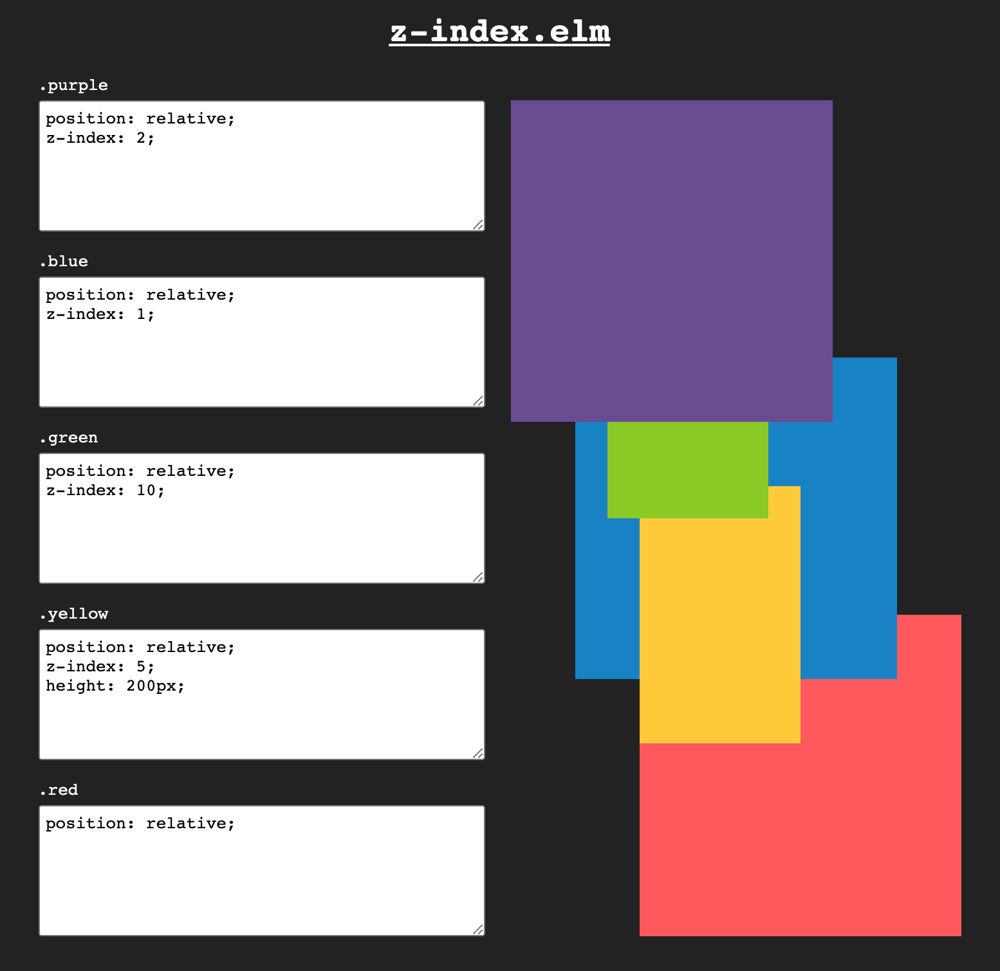

Also remember that before we said that positioned elements appear on top of
non-positioned elements? Well, now we can generalize by saying that
elements that form a stacking context appear on top of non-positioned
elements.

## The usual suspects

The
[MDN article](https://developer.mozilla.org/en-US/docs/Web/CSS/CSS_Positioning/Understanding_z_index/The_stacking_context)
lists all cases when a new stacking context is formed. I'm going to go through a
list of usual suspects.

[Opacity less than 1](https://z-index.juliu.is/?css=p%2Bopacity%3A%200.90)


[Transform and filter effects](https://z-index.juliu.is/?css=p%2Btransform%3A%20rotate(30deg))

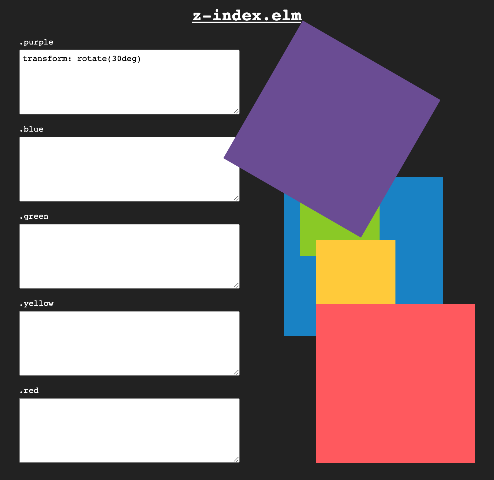

[Flex child with z-index](https://z-index.juliu.is/?css=b%2Bdisplay%3A%20flex%7Cp%2Bposition%3A%20relative%3Bz-index%3A%201%7Cy%2Bz-index%3A%202)

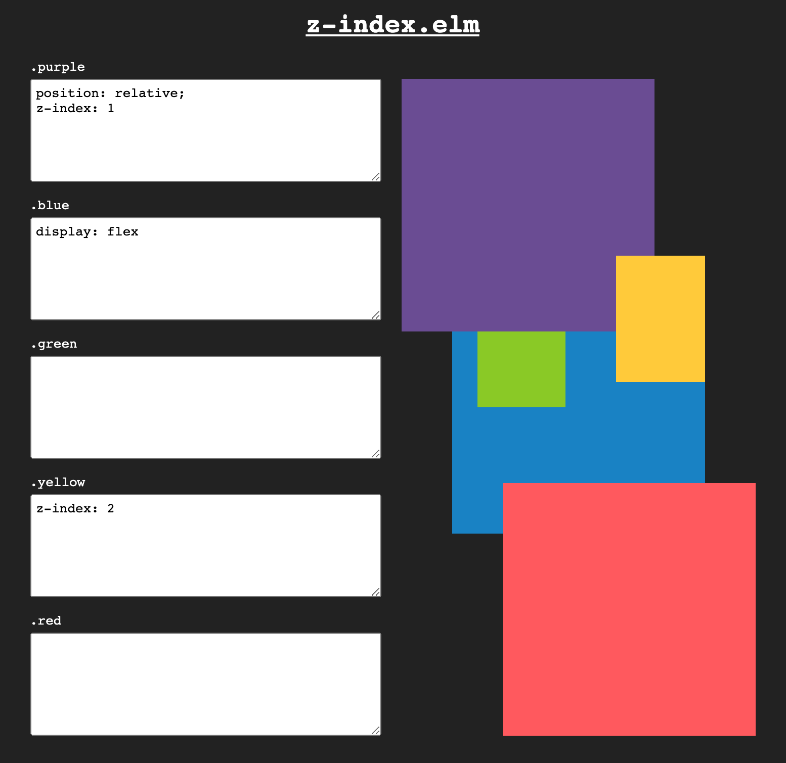

[Grid child with z-index](https://z-index.juliu.is/?css=b%2Bdisplay%3A%20grid%7Cg%2Bz-index%3A%202%7Cp%2Bposition%3A%20relative%3Bz-index%3A%201)

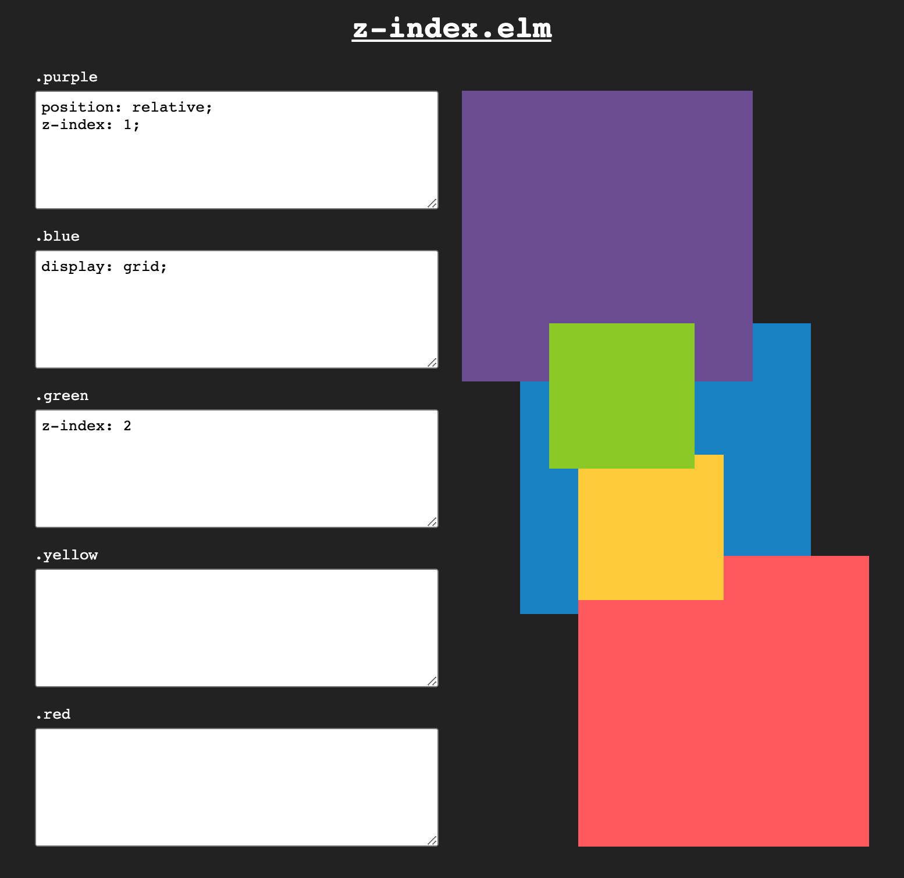

Some of these examples might look surprising. In general, the underlying
reason why these configurations create a new stacking context is that they
render to an offscreen context. But in practice, you don't need to remember
all of them: when you bump into a situation where `z-index` isn't working
as intended, you can quickly check if there's a runaway stacking context
that's keeping you locked up.

I recommend going through each one of the examples, playing around with
them, and explaining in your head why they make perfect sense. It might be
helpful to install a browser extension to help check your intuition and
solidify your understanding
([Chrome](https://chrome.google.com/webstore/detail/z-context/jigamimbjojkdgnlldajknogfgncplbh),
[Firefox](https://addons.mozilla.org/en-GB/firefox/addon/devtools-z-index/)).

That's all I have for you today. As always, thanks for reading!
